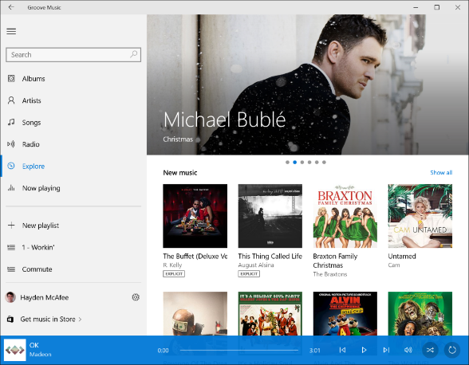

# Set dark mode

This personalization setting for end users allows them to express preference whether to see applications which support the setting in a dark or light mode.


Many Microsoft first party applications apply the setting and it is easy for you to support the functionality in your UWP applications as well.



You can customize the default Windows theme via Unattend.xml. The Unattend component includes a setting `UWPAppsUseLIghtTheme` that configures dark mode as the default for apps that support it.

```xml
<settings pass="oobeSystem">
        <Themes>
            <ThemeName>MyOLEDTheme</ThemeName>
            <DefaultThemesOff>false</DefaultThemesOff>
            <DesktopBackground>c:\windows\OLEDFriendlyImage.jpg</DesktopBackground>
            <WindowColor>Lime</WindowColor>
            <UWPAppsUseLightTheme>false</UWPAppsUseLightTheme>
        </Themes>
    </settings>
```

To learn more about customizing Windows themes, see [Themes](https://docs.microsoft.com/en-us/windows-hardware/customize/desktop/unattend/microsoft-windows-shell-setup-themes) in the Unattended Windows Setup Reference.
