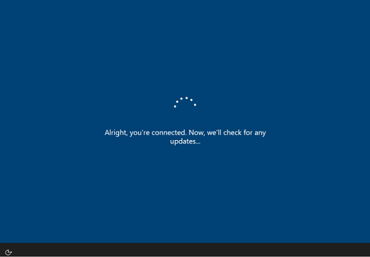

# Windows updates during OOBE

Critical driver updates, and critical Windows zero-day patch (ZDP) updates, will begin downloading automatically during OOBE after the user has [connected to a network](oobe-screen-details.md#connect-users-to-the-network). The user can't opt-out of these critical updates as they are required for the device to operate properly. Windows will alert the user that the device is checking for, and applying, the updates:

A user can also opt-in to **Get the latest from Windows** during OOBE, if a newer version of Windows is available than the version that shipped with the device. Version updates are considered non-critical, as the device will still continue to perform well after OOBE if the user does not download the update. In Windows 10, version 1803, the **Get the latest from Windows** screen is displayed right after the **Let's connect you to a network** screen in OOBE. This is a change from previous versions of Windows, where this screen had a different title and was displayed at the end of OOBE.

> [!Note]
> Users will only see this screen in OOBE if there is a newer version of Windows available than the version that shipped with the device. For example, the screen above will be displayed on devices shipped with Windows, version 1803, but only after the next version of Windows is available.

This screen informs the user of the size of the update. The size of the update, and the user's network conditions, will determine the download time.

The user has the option to click **Get it** or **Skip for now**. In either case, the user's selection will not disrupt their progression through OOBE. Clicking either **Get it** or **Skip for now** will cause the user to move to the next screen in OOBE.

If the user clicks **Get it**, the Windows update will begin downloading as soon as the user has completed OOBE and reached their desktop. It will not begin downloading during OOBE. The user will see a toast message letting them know that the download is taking place, and they will be prompted to restart the device when Windows is ready to install the update. They can continue to use their device while the latest version of Windows is downloading, although performance may be impacted.

If the user selects **Skip for now**, the Windows update will not download after the user has completed OOBE and reached their desktop. The user can choose to download the update at a time of their choosing from the **Settings** app in Windows.
