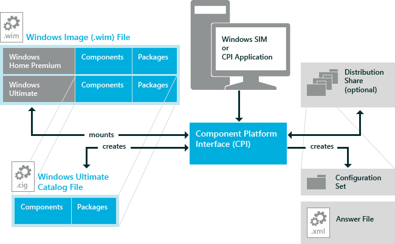

# Windows System Image Manager Architecture

You use Windows® System Image Manager (Windows SIM) to create an XML-based answer file that is required to automate Windows installations.

Windows SIM uses the Component Platform Interface (CPI API) to create and manage answer files. The components and settings in a specific Windows image are used to create a catalog file. This catalog file is used in Windows SIM to create answer files. For more information, see [Windows Image Files and Catalog Files Overview](windows-image-files-and-catalog-files-overview.md).

An optional set of folders, called a distribution share, can be created to store files that you use to further customize your Windows installation. For more information, see [Distribution Shares and Configuration Sets Overview](distribution-shares-and-configuration-sets-overview.md).

Windows SIM can create a smaller, more portable version of a distribution share called a configuration set. These smaller files can be easier to manage.

You can also use the CPI API to create your own customized applications that can automate the creation and management of unattended Windows Setup answer files. For more information, see the ***Component Platform Interface (CPI) Reference* (CPIAPI.chm)**.

The following diagram shows how Windows SIM works.

## Related topics

[Windows System Image Manager Reference Topics](windows-system-image-manager-technical-reference.md)

[Windows System Image Manager Overview Topics](windows-system-image-manager-overview-topics.md)
