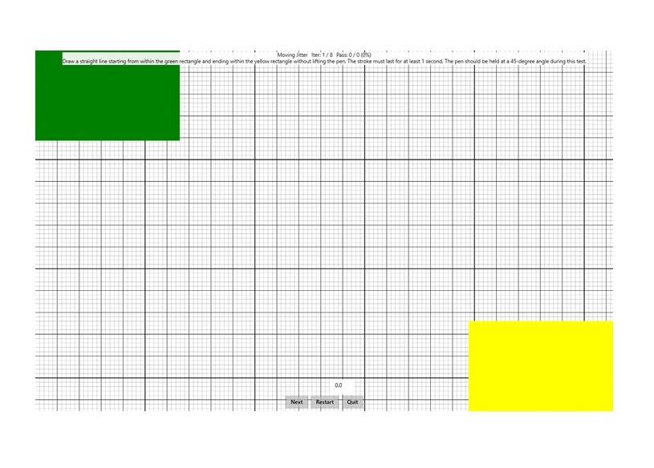

# Moving Jitter

This is to test the behavior (the jitter aspect) of the Windows pen device, while it's in contact with the screen, and moving.

**Test name**

-   MovingJitter

**Core requirements tested**

-   Device.Input.Digitizer.Pen.Jitter – Moving Jitter.
-   Device.Input.Digitizer.Pen.ReportRate.

**Test purpose**

-   Verifies that while pen is in motion, and in contact with the screen, the maximum orthogonal distance between points from line of best fit, is within allowed limits.

**Tools required**

-   PT3 with Pen holder + 150g weight.

**Validation steps**

1. Run the test case for Moving jitter.

2. For the purpose of this test, the pen should be held at an angle of 45 degrees in the pen holder.

3. Following the instructions on the screen, draw a line starting from within the green rectangle, and ending within the yellow rectangle without lifting the pen. The stroke must last for at least 1 second.

Here's a screenshot from the Moving Jitter test.

**Common error messages**

-   "Distance from line of best fit too large."

    Occurs if the pen stroke’s jitter deviates too far from the line of best fit (defined as the straight line between the first and last packets).
-   "The contact did not begin/end in the correct location."

    Occurs if the pen stroke does not begin in the green rectangle and end in the yellow rectangle.
-   "The interaction’s duration was too short."

    Occurs if the pen stroke does not last the required duration.
-   "Report rate too low."

    Occurs if the pen fails the report rate requirement of &gt;= 133 Hz with a tolerance of 7 Hz.

**Passing criteria**

-   7/8 test iterations must pass for test success.
-   This test has an allowed tolerance of 0.05 mm for moving jitter, therefore a recorded moving jitter &lt;= 0.45 mm will result in the iteration passing.
-   Any iteration that is more than 0.1 mm beyond the allowed tolerance, resulting in a recorded moving jitter &gt;= 0.5 mm, will fail the entire test.
