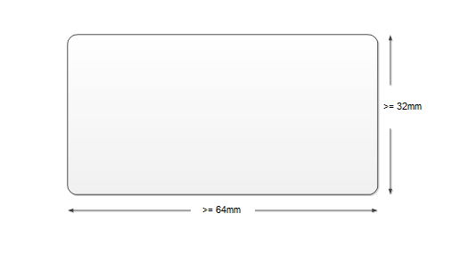
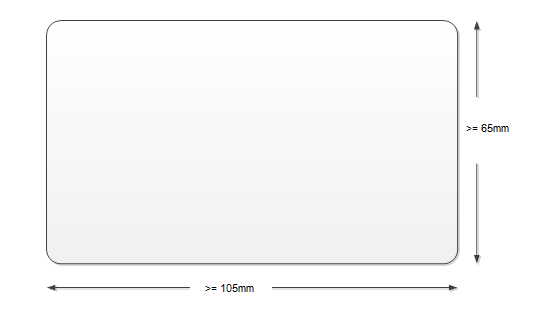
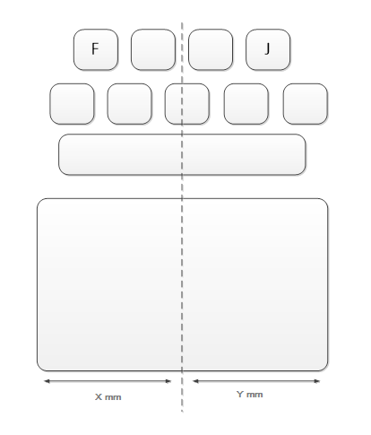
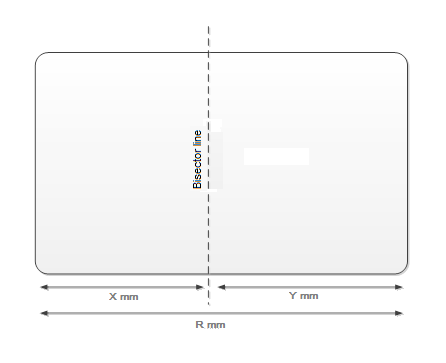
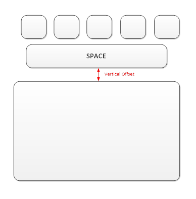

# Device Integration

This topic discusses the considerations and requirements for integrating a Windows Precision Touchpad device into a host system.

Windows Precision Touchpad devices define an experience, and integration of the device has a significant impact on how accurately that experience is implemented. The following sections provide information about the various factors that have to be considered for a successful device integration.

## Size

A Windows Precision Touchpad device should have a sensor with minimum dimensions of 32mm x 64mm, as shown in the following diagram. This should be the minimum permissible size that is reported via the physical maximum for X and for Y in the report descriptor.

The best Windows Precision Touchpad devices should have the recommended dimensions of approximately 65mm x 105mm, as shown in the following diagram, to allow for more comfortable interactions.

## Placement

Windows Precision Touchpad placement is defined by three measurements: horizontal offset, vertical offset and depth offset.

**Horizontal Offset**

The optimal placement for a Windows Precision Touchpad is to center the device with the line which bisects the 'F' and 'J' keys of the integrated keyboard as shown in the following diagram.

If a Windows Precision Touchpad device cannot be integrated with the optimal zero offset, then the integrator should store the positive or negative offset value (in himetric units) in the registry to allow the host device to compensate.

If a device has an offset, the value to store is calculated by taking the length of the touchpad to the right of the bisecting line (Y) and subtracting the length of the touchpad to the left of the bisecting line (X), such that Y – X = Offset value. If a device has a right offset, this value will be positive, whereas a device with a left offset will result in a negative value. The following diagram shows the 'X' and 'Y' distances referenced in the preceding explanation.

The Windows registry key that stores information about the horizontal offset of the touchpad is:

**HKEY\_LOCAL\_MACHINE\\Software\\Microsoft\\Windows\\CurrentVersion\\PrecisionTouchPad**
And here are the relevant variables with their values:

<table>
<colgroup>
<col width="20%" />
<col width="20%" />
<col width="20%" />
<col width="20%" />
<col width="20%" />
</colgroup>
<thead>
<tr class="header">
<th>Setting</th>
<th>Name</th>
<th>Type</th>
<th>Default value</th>
<th>Value</th>
</tr>
</thead>
<tbody>
<tr class="odd">
<td>Horizontal Offset</td>
<td>HorizontalOffset</td>
<td>DWORD</td>
<td>0</td>
<td>Absolute offset distance in himetric units.</td>
</tr>
<tr class="even">
<td>
Indicate Negative
</td>
<td>
HorizontalOffsetIsNeg
</td>
<td>
DWORD
</td>
<td>
0
</td>
<td>
0 = Positive Offset

1 = Negative Offset
</td>
</tr>
</tbody>
</table>

 

**Vertical Offset**

Windows Precision Touchpad devices can be integrated at different vertical offsets from the keyboard spacebar as shown in the following diagram. The integrator should store the positive offset (in himetric units) in the registry, to allow the host to compensate. If a value is not provided, the host should assume a default offset of 14mm.

The Windows registry key that stores information about the vertical offset of the touchpad is:

**HKEY\_LOCAL\_MACHINE\\Software\\Microsoft\\Windows\\CurrentVersion\\PrecisionTouchPad**
And here is the relevant variable with its default value:

| Setting         | Name           | Type  | Default value | Value                              |
|-----------------|----------------|-------|---------------|------------------------------------|
| Vertical Offset | SpaceBarOffset | DWORD | 1000          | Offset distance in himetric units. |

 

**Note**  If the touchpad is not below the space bar, but is in fact located above the keyboard, leave the vertical offset at the default value.

 

**Depth Offset**

Windows Precision Touchpad devices should be integrated such that the digitizer surface is flush with the palm deck. And as shown in the following diagram, up to 1.5mm of depth offset is ideal, due to manufacturing and integration tolerances. However, the highest quality implementations should aim to eliminate this offset. Note that for Windows 10, this is a recommendation, not a requirement.

 

 

