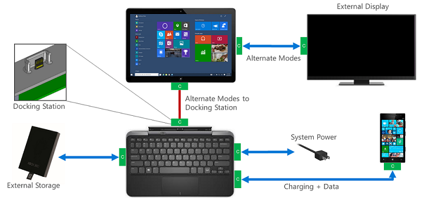
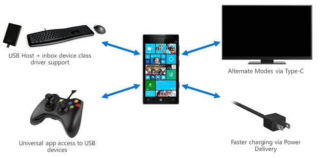

# Universal Serial Bus (USB)

This document provides recommendations for the design and development of USB components. The goal of this document is to enable ecosystem partners to build a device with optimized USB functionality.

## USB features in Windows 10

Windows 10 supports:

-   Dual Role controllers, which can function as either a USB Host or a USB Device. For example, a phone can connect to a PC as a USB device or it can connect to other USB peripherals as a USB host.

-   USB Type C, a flippable, reversible USB connector approximately the same size as a USB micro-B connector. In addition, USB Type-C provides support for the following features:

    -   USB 3.1 Gen 2 (10Gb/s)
    -   Power Delivery, enabling devices and systems to provide and consume up to 20V, 5A.
    -   Alternate Modes, enabling non-USB protocols such as DisplayPort, Thunderbolt, or MHL to use the USB Type-C connector.
    -   Billboard error message
-   USB 2.0, 3.0, and now USB 3.1, allowing OEMs to easily choose from a wide variety of controllers and peripherals.

-   [Universal drivers](https://msdn.microsoft.com/library/windows/hardware/dn941241.aspx) can be built for USB peripherals that run on all Windows 10 Devices, from Internet-of-Things (IOT) to servers.

Partners are recommended to test these  features by using the [Hardware Lab Kit](https://msdn.microsoft.com/library/windows/hardware/dn930814.aspx) and to visit the [USB Core Team blog](http://blogs.msdn.com/b/usbcoreblog/) for updated info about features and HLK tests, including these posts related to Windows 10:

-   [USB tests in the Windows 10 Hardware Lab Kit (HLK)](http://blogs.msdn.com/b/usbcoreblog/archive/2015/05/15/usb-tests-in-the-windows-10-hardware-lab-kit-hlk.aspx)

-   [New in Windows 10: USB Dual Role, Type-C, SuperSpeedPlus, and much more…](http://blogs.msdn.com/b/usbcoreblog/archive/2015/05/11/new-in-windows-10-usb-dual-role-type-c-superspeedplus-and-much-more.aspx)

-   [New in Windows 10: USB Dual Role on Mobile](http://blogs.msdn.com/b/usbcoreblog/archive/2015/05/11/new-in-windows-10-usb-dual-role-on-mobile.aspx)

### USB scenarios for Windows 10 devices

Windows 10 enables hardware vendors to innovate and build great Dual Role and USB Type-C systems. A few examples of the scenarios enabled by USB features in Windows 10 are illustrated below:

-   Replace proprietary docking connectors with industry standard USB Type-C connector

-   Faster charging via USB Type-C current and/or Power Delivery

-   Allow for external USB peripherals to charge the system

-   Output video/audio over USB Type-C using Alternate Modes

-   Connect USB peripherals to Windows Mobile devices

-   Write Universal Applications that can interact with custom USB peripherals

Figure 1 Example of new USB scenarios for a Windows 10 Desktop system

Figure 2 Example of new USB scenarios for a Windows 10 Mobile device

## Guidelines for USB for Windows 10

-   In general, USB should “just work” with minimal user interaction.
-   Hardware/firmware is expected to make the initial policy decisions introduced with the Dual Role, Power Delivery, and Alternate Mode features.
-   Windows will make policy adjustments to improve the user experience and help the user to troubleshoot issues if things go wrong.
-   Partners should ensure their USB hardware (such as systems, hubs, cables, or accessories) can interoperate with other USB hardware coming to or already on the market. We encourage participation in USB-IF-hosted interoperability and compliance events.
-   We recommend supporting the DisplayPort Alternate Mode for outputting video/audio over USB Type-C.
-   For systems with multiple USB ports that have different USB capabilities, we recommend making it clear to the customer which ports have which capabilities. For example, an icon imprinted next to the USB port can be used to show that the port supports Alternate Modes and Power Delivery.
-   Partners should follow the latest ACPI spec for how to properly describe their USB ports, such as the \_UPC and \_PLD methods.

## Minimum hardware requirements for USB

USB is optional for all devices and computers that run Windows 10. Windows 10 supports the following USB controllers:

-   Function controllers
-   Host controllers
-   [Dual-role OTG controllers](https://msdn.microsoft.com/library/windows/hardware/dn957036.aspx)

For the complete set of hardware requirements for Windows 10, see [Minimum hardware requirements](https://msdn.microsoft.com/library/windows/hardware/dn915086.aspx).

## Windows Hardware Compatibility Program specifications for USB
 The Windows Hardware Compatibility Program leverages tests in the Windows [Hardware Lab Kit](https://msdn.microsoft.com/library/windows/hardware/dn930814.aspx) (HLK), which OEMs can use to help diagnose issues early in the development process, ensure driver compatibility with Windows, and optionally certify devices or systems. Tests in the HLK can validate Dual Role and Function mode on any Windows 10 edition.

The [System.Fundamentals.SystemUSB.SystemExposesUSBPort](https://msdn.microsoft.com/library/windows/hardware/dn932827.aspx#systemfundamentalssystemusbsystemexposesusbport) Windows Hardware Compatibility Program requirement lists which USB controller types are recommended, supported, or not supported.

## Maintained guidelines for USB from Windows 8.1

These guidelines from Windows 8.1 are maintained for Windows 10.

### Hardware

For improved power efficiency and performance, it is recommended USB Host Controllers are at least USB 3.0 compatible with an XHCI controller integrated into the SoC or chipset. The operating system supports standard EHCI and XHCI 1.0 controllers, including debug registers. If the host controller is not fully compatible with the published standard specifications, the deviations must be documented and support for the host controller is determined on a case-by-case basis. In addition, the debug capability is important for XHCI host controllers.

| USB Host Controller Interface                          | Remarks                                              |
|--------------------------------------------------------|------------------------------------------------------|
| XHCI 1.0+Errata or higher (including debug capability) | Required per the Windows HLK starting from June 2012 |
| EHCI                                                   | Supported                                            |
| UHCI/OHCI Companion Controllers                        | Not-supported                                        |

## Related Resources

### Blogs

[USB Core Team blog](http://blogs.msdn.com/b/usbcoreblog/)

[Windows Hardware Certification blog](https://blogs.msdn.microsoft.com/windows_hardware_certification/)

### Videos

[Docking](https://channel9.msdn.com/events/WinHEC/WinHEC-December-2016/Docking)

[Enabling New USB Connectivity Scenarios](https://channel9.msdn.com/Events/WinHEC/2015/WHT200)

[Building New Apps for USB Accessories](https://channel9.msdn.com/events/Build/2015/3-81)

[Building great USB 3.0 devices](http://channel9.msdn.com/events/BUILD/BUILD2011/HW-773T)

[Integrating with the Windows Device Experience](http://channel9.msdn.com/events/BUILD/BUILD2011/APP-408T)

[Running Windows from an External USB drive with Windows To Go](http://channel9.msdn.com/events/BUILD/BUILD2011/HW-245T)

### Other Guides and Reference

[Windows 10: What's new for USB](https://msdn.microsoft.com/library/windows/hardware/dn957037.aspx)

[Universal Serial Bus (USB) Drivers](http://go.microsoft.com/fwlink/?LinkId=227351)

[Setting Up a USB 3.0 Connection in Visual Studio](http://go.microsoft.com/fwlink/?LinkId=227376)

[Setting Up a USB 3.0 Connection Manually](http://go.microsoft.com/fwlink/?LinkId=227380)

[USB Reference](http://msdn.microsoft.com/library/windows/hardware/ff540134.aspx)