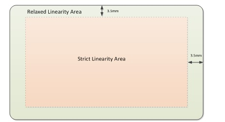
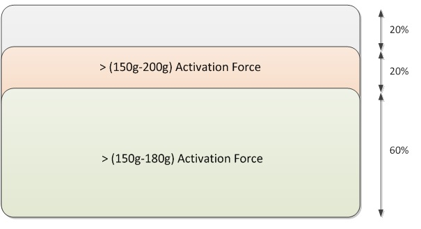

#  Module Design for Windows HCK Requirements

The Windows Hardware Certification Kit (HCK) requirements for Windows Precision Touchpads are designed to provide a consistent user experience where precision and reliability are at the forefront. These requirements shall influence all aspects of the module, including the sensor, controller IC and associated mechanics.

## Sensor design

The design of the sensor in the Windows Precision Touchpad module is essential to ensuring an accurate representation of the user’s finger interactions.

Although a specific sensor pitch is not mandated in this implementation guide, it should be understood how a larger sensor pitch can introduce challenges when attempting to meet or exceed specific requirements.

### Minimum input separation

Related HCK requirements:

-   Device.Input.PrecisionTouchpad.Performance.MinSeparation
-   Device.Input.PrecisionTouchpad.Precision.ContactDivergence
-   Device.Input.PrecisionTouchpad.Precision.HVInputSeparation
-   Device.Input.PrecisionTouchpad.Precision.DiagonalInputSeparation

Ensuring that each unique finger contact is identified and reported is essential for consistent and reliable gesture recognition.

Windows Precision Touchpads shall not alias contacts aligned vertically or horizontally at a minimum separation of 10mm or aligned diagonally at a minimum separation of 13mm irrespective of whether the contacts are stationary, diverging, converging or being interleaved.

### Surface and edge contact detection

Related HCK requirements:

-   Device.Input.PrecisionTouchpad.Precision.EdgeDetection
-   Device.Input.PrecisionTouchpad.Reliability.ContactsReported

Ensuring that contacts are registered and reported as close to the edge of the sensor is essential for consistent and reliable edge gesture recognition.

Windows Precision Touchpads shall detect and report contacts anywhere on the digitizer surface within a maximum of 2mm of the edge of the digitizer surface irrespective of whether the contacts are within, entering or exiting the sensor area.

## Controller IC design

The design of the controller IC in the Windows Precision Touchpad module is essential to ensuring an accurate representation of the user’s finger interactions.

### Position Reporting

Related HCK requirements:

-   Device.Input.PrecisionTouchpad.Precision.MotionJitter
-   Device.Input.PrecisionTouchpad.Precision.Position
-   Device.Input.PrecisionTouchpad.Precision.StationaryJitter

The kinematics of the surface contacts shall be reported as accurately as possible to the host by a Windows Precision Touchpad. If a contact is stationary it shall be reported with stationary coordinates. A moving contact shall have its position accurately reported with respect to the scan time value.

### Linearity

Related HCK requirements:

-   Device.Input.PrecisionTouchpad.Precision.Linearity

The reporting of subtle movements by the user is an essential part of a precise and responsive user experience; however the lack of deviation and ability to follow the vector of a finger precisely is just as critical.

Windows Precision Touchpads shall maintain linearity within 0.5mm for all contacts reported across edge to edge travel horizontally, vertically, and diagonally. Within 3.5mm of any edge, precision touchpads shall maintain linearity within 1.5mm for all contacts reported.

**Figure 1 Linearity**

### Latency and report rate

Related HCK requirements:

-   Device.Input.PrecisionTouchpad.Precision.ActiveTouchdownLatency
-   Device.Input.PrecisionTouchpad.Precision.IdleTouchDownLatency
-   Device.Input.PrecisionTouchpad.Precision.PanLatency
-   Device.Input.PrecisionTouchpad.Performance.ReportRate

User-perceived latency significantly diminishes the experience of a Windows Precision Touchpad and therefore all aspects of the system from end-to-end shall meet or exceed specified latency goals. Providing a minimal input report rate of 125Hz for single contacts and 100Hz for multiple contacts ensures that with the correct scan frequencies, contact down and update latencies of 25ms and 15ms respectively can be achieved.

### Reliability

Related HCK requirements:

-   Device.Input.PrecisionTouchpad.Reliability.ContactSuppression
-   Device.Input.PrecisionTouchpad.Reliability.FalseContacts
-   Device.Input.PrecisionTouchpad.Reliability.PowerStates

The most critical aspect of a digitizer system is ensuring that spurious contacts are not reported. Spurious contacts can occur due to noise interference that is introduced to the system from a variety of sources; the Windows Precision Touchpad controller shall ensure that these are never reported to the host.

A user can make contact with a Windows Precision Touchpad at any time (either intentional or inadvertent) and the controller must ensure that it can boot correctly irrespective of surface contacts or button state and be able to report contacts in accordance with the HCK requirements once all the initial contacts have been removed. Should a Windows Precision Touchpad detect more contacts on the surface than is supported for contact reporting and tracking, it shall report an up for all contacts and buttons, and cease all reporting until all contacts have been removed.

## Mechanical design

The design of the mechanics in the Windows Precision Touchpad module is essential to ensuring a consistent user experience.

### Button activation force

Related HCK requirements:

-   Device.Input.PrecisionTouchpad.Hardware.ClickpadPress
-   Device.Input.PrecisionTouchpad.Hardware.PressurePadPress

Irrespective of button type implementation, a button down state shall be reported by a Windows Precision Touchpad when a force that is greater than 150g-180g is applied to the contact area. The best Windows Precision Touchpads shall strive to provide uniform activation across the entire contact area (this is required for pressure-pad implementations), however at a minimum Windows Precision Touchpads shall ensure that applied activation force, as shown in *Figure 2 Activation Force*, results in button down reporting.

**Figure 2 Activation Force**

 

 

