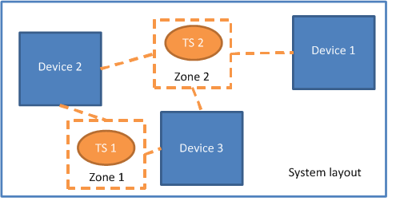
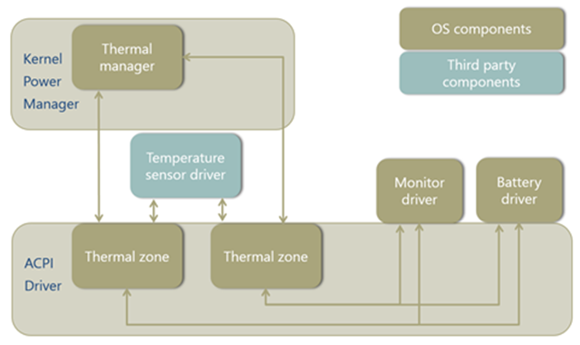
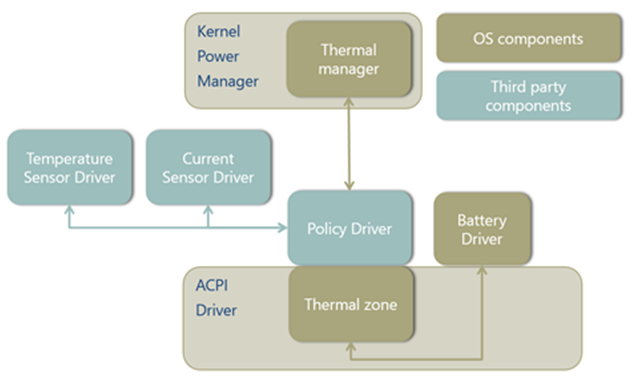
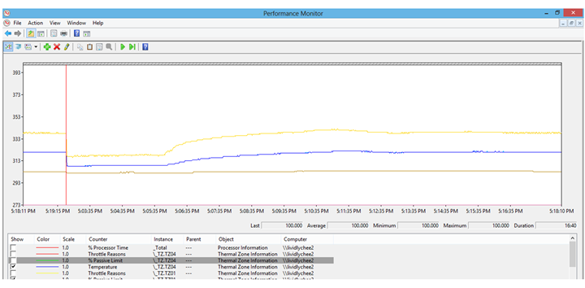
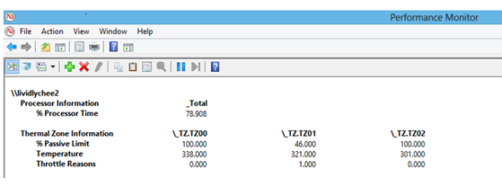
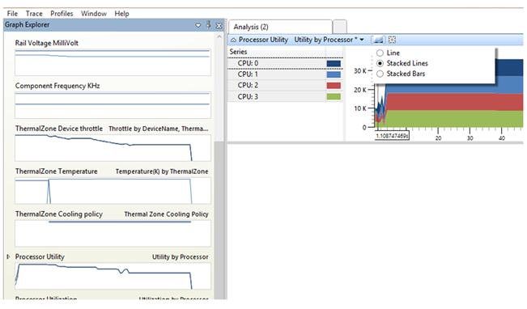
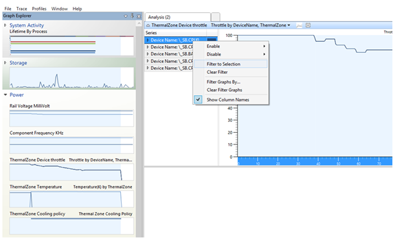
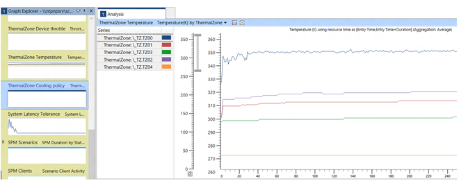

# Examples, Requirements and Diagnostics


This topic presents examples of thermal management issues, and also discusses requirements and diagnostic methods.

## Examples


The following examples explain how to address typical thermal management issues.

**Skin temperature sensors**

Monitoring the skin temperature is critical in ensuring that the user is protected at all times. If the temperature on the skin is too hot to handle safely, the system should take immediate action to shut down the system. These temperature sensors can also give input to the thermal zones to throttle devices that contribute to its reading.

The following block diagram shows an example system layout that has three devices and two thermal zones.



In this example, Temperature Sensor 1 (TS1) and Temperature Sensor 2 (TS2) are placed strategically at locations where the devices contribute the most heat to the skin. Devices 1, 2, and 3 may have individual temperature sensor on top of each device. These device sensors are geared towards throttling each device individually. Usually, the purpose of the skin sensor is to detect the temperature on the surface of the device as an aggregate of multiple devices on the system. Although each device might produce more heat than can be detected at these temperature sensors, the combined heat production of these devices tends to accumulate at these sensor locations.

TS1 is placed midway between Device 2 and Device 3. Thus, the thermal zone that takes TS1 as input controls Device 2 and Device 3. When TS1 gets hot, the thermal zone throttles Device 2 and 3. Similarly, when TS2 gets hot, the thermal zone throttles all three devices.

In this example, the sensors are placed equally far from the devices that they monitor. TS1 is placed midway between Device 2 and Device 3, and TS2 is placed equidistant from Devices 1, 2, and 3. If each device dissipates heat radially the same way, the heat from each device contributes equally to the temperature reading on its sensor.

**Gradual thermal throttling**

Given a set of thermal constants (\_TC1 and \_TC2), the passive throttling percentage of a thermal zone has certain characteristics: how quickly the curve changes, and how aggressively the zone throttles to remain far from the trip point. In some circumstances, the behavior of the thermal zone might need to change. For example, when the temperature is low, the throttle percentage can afford to be less aggressive. But when the temperature is closer to the trip point, the throttling behavior might need to be much more aggressive. If so, gradual thermal throttling can be used to apply different throttling behaviors to a set of devices. There are two ways of implementing gradual thermal throttling:

-   Dynamically change the constants for a thermal zone during runtime, or
-   Using two thermal zones with different constants and trip points.

*Updating constants for zones*

For any thermal zone, a `Notify(thermal_zone, 0x81)` can be used to update the thermal constants at any time.

*Zones with different trip points*

There can be no more than one thermal sensor in a thermal zone. However, multiple thermal zones that share the same temperature sensor are frequently used to implement gradual thermal throttling behavior. One thermal zone starts to throttle performance moderately at low temperatures while the other thermal zone starts to throttle performance aggressively at high temperatures.

In the following block diagram, two thermal zones that manage the same devices use the same temperature sensor to achieve gradual thermal throttling. In this example, the temperature sensor is placed near the battery charger and the monitor backlights so that it can provide inputs to thermal zones that control these two devices.



The two thermal zones shown in the preceding diagram might be defined as follows:

```
Thermal Zone 1 {     _PSV = 80C  Thermal Throttling  Devices:    Monitor Driver  Battery Driver } Thermal Zone 2 {   _PSV = 90C  Thermal Throttling  Devices:    Monitor Driver  Battery Driver }
```

**Current-dependent throttling**

If the battery driver requires throttling based on both temperature and electrical current, the ACPI algorithm in thermal manager is no longer adequate because it cannot take current into account. To replace this algorithm, you must provide a policy driver that contains a custom algorithm, and load this driver on top of the driver stack for the thermal zone. This policy driver treats both the temperature sensor and current sensor as inputs, and arrives at a thermal policy based on the custom algorithm. Note that this thermal policy must operate within the capabilities of the thermal zone hardware. The policy is sent to the thermal manager, which updates logs and updates the thermal zone. The thermal zone then sends requests to the battery driver via the thermal cooling interface.

The following block diagram shows a policy driver that controls both the temperature and current of a battery device. The policy driver implements a custom algorithm in place of the thermal manager's algorithm. Unlike the thermal manager's algorithm, the custom algorithm takes both temperature and current into account.



## <a href="" id="thermal-requirements"></a>Thermal management requirements


*Hardware requirements*

The following points are required for a good thermal hardware design:

-   All systems meet applicable industry standards (for example, IEC 62368) for consumer electronics safety.
-   Hardware must have fail-safe temperature trip point that shuts down the system or prevents boot.
-   Sensor hardware must be accurate to +/- 2<sup>o</sup>C.
-   Sensor hardware must not require software polling to determine that a threshold temperature has been exceeded.
-   While operating, the system display brightness is never thermally limited to less than 100 nits.
-   Battery charging is not throttled while either:

    -   The system is idle and within the ambient temperature range below 35<sup>o</sup>C, or
    -   The ambient temperature is below 25<sup>o</sup>C under any conditions.

### <a href="" id="hck-test"></a>

*HCK test requirements for modern standby PCs*

All modern standby PCs must meet certain thermal requirements regardless of processor architecture and form factor. These requirements are tested for in the HCK:

-   All modern standby PCs must have at least one thermal zone.
-   Each thermal zone must report actual temperature on the sensor.
-   At least one thermal zone must have critical shutdown temperature defined. An exception is made for Intel Dynamic Platform and Thermal Framework (DPTF).
-   All modern standby PCs with fans must expose fan activity to the operating system.
-   The fan needs to notify the operating system of its activity at all times, including during idle resiliency in modern standby. Currently, these notifications cause no action from the operating system. The main purposes for these notifications are diagnosability and telemetry. The fan notification can be integrated with existing tracing tools, including Windows Performance Analyzer. System designers can use these tools to tune the platform design.
-   All modern standby PCs with fans must keep the fan off while in modern standby, the system "sleep" state.
-   The HCK test here runs a realistic modern standby workload that should not cause the fan to turn on. During the transition to modern standby, the fan is allowed to stay on for up to 30 seconds from the time the display turns off.

For more information about the HCK tests, see [Check Thermal Zones](http://msdn.microsoft.com/library/windows/hardware/jj123515.aspx).

To run the HCK tests, do the following:

-   First, enter this command to install the button driver:

    `>>Button.exe -i`

-   To run all thermal tests for a PC with a fan, enter this command:

    `>>RunCheckTz.cmd all`

-   To run all thermal tests for a PC without a fan, enter this command:

    `>>RunCheckTz.cmd nofan all`

**Thermal management solutions**

The Window thermal framework based on ACPI is the recommended thermal management solution for all systems. The primary benefits include the ability to easily diagnose thermal issues with inbox tools, and the ability to gather valuable telemetry in the field.

However, alternative solutions to the Windows thermal framework are acceptable if the above requirements are met. Core silicon and SoC vendors may have their own proprietary thermal solutions that are compatible with and supported by Windows—for example, implementations based on Intel Dynamic Platform and Thermal Framework (DPTF) for x86 processors and PEP implementations on ARM.

## Diagnostics


To help system designers diagnose and evaluate system thermal behavior, Windows provides the following inbox and stand-alone tools.

**Event logs**

Windows records important thermal information in the event logs. This information can be used to quickly triage thermal conditions on any PC running Windows 8 or later without the need for additional tracing or tools. The following table contains the full list.

<table>
<colgroup>
<col width="25%" />
<col width="25%" />
<col width="25%" />
<col width="25%" />
</colgroup>
<thead>
<tr class="header">
<th>Channel</th>
<th>Source</th>
<th>ID</th>
<th>Event description</th>
</tr>
</thead>
<tbody>
<tr class="odd">
<td>Windows Logs\System</td>
<td>Kernel power</td>
<td>125</td>
<td><strong>ACPI thermal zone being enumerated.</strong>
<p>Windows logs this event during boot for every thermal zone.</p></td>
</tr>
<tr class="even">
<td>Windows Logs\Systems</td>
<td>Kernel power</td>
<td>86</td>
<td><strong>The system was shut down due to a critical thermal event.</strong>
<p>After a critical shutdown, Windows logs this event. This event can be used to diagnose whether a thermal critical shutdown has happened and to identify the thermal zone that caused the shutdown.</p></td>
</tr>
<tr class="odd">
<td>Applications and Services Logs\Microsoft\Windows\Kernel-Power\Thermal-Operational</td>
<td>Kernel power</td>
<td>114</td>
<td><strong>One thermal zone has engaged or disengaged passive cooling.</strong>
<p>Windows logs this event when thermal throttling engages and disengages. This event can be used to confirm whether thermal throttling has happened and for which zones. This is helpful when triaging performance problems.</p></td>
</tr>
</tbody>
</table>

 

*Critical event notification*

In the event of a critical shutdown or hibernate caused by thermal conditions, the operating system must be notified of the event so that it can be recorded in the system event log. There are two ways to notify the operating system when this occurs:

-   Use the ACPI thermal zone \_CRT or \_HOT method to automatically log the critical thermal event correctly. No additional work is needed other than to define a \_CRT or \_HOT value.
-   For all other thermal solutions, the driver can use the following thermal event interface, which is defined in the Procpowr.h header file:

    ```ManagedCPlusPlus
    #define THERMAL_EVENT_VERSION 1 typedef struct _THERMAL_EVENT { ULONG Version; ULONG Size; ULONG Type; ULONG Temperature; ULONG TripPointTemperature; LPWSTR Initiator;  } THERMAL_EVENT, *PTHERMAL_EVENT;  #if (NTDDI_VERSION >= NTDDI_WINBLUE) DWORD PowerReportThermalEvent ( _In_ PTHERMAL_EVENT Event ); #endif
    ```

    The **PowerReportThermalEvent** routine notifies the operating system of a thermal event so that the event can be recorded in the system event log. Before calling **PowerReportThermalEvent**, the driver sets the members of the **THERMAL\_EVENT** structure to the following values.

    <table>
    <colgroup>
    <col width="100%" />
    </colgroup>
    <tbody>
    <tr class="odd">
    <td><p></p>
    <dl>
    <dt><strong>Version</strong></dt>
    <dd><p>THERMAL_EVENT_VERSION</p>
    </dd>
    <dt><strong>Size</strong></dt>
    <dd><p>sizeof(THERMAL_EVENT)</p>
    </dd>
    <dt><strong>Type</strong></dt>
    <dd><p>One of the THERMAL_EVENT_<em>XXX</em> values from Ntpoapi.h.</p>
    </dd>
    <dt><strong>Temperature</strong></dt>
    <dd><p>The temperature, in tenths of a degree Kelvin, that the sensor was at after crossing the trip point (or zero if unknown).</p>
    </dd>
    <dt><strong>TripPointTemperature</strong></dt>
    <dd><p>The temperature, in tenths of a degree Kelvin, of the trip point (or zero if unknown).</p>
    </dd>
    <dt><strong>Initiator</strong></dt>
    <dd><p>A pointer to a NULL-terminated, wide-character string that identifies the sensor whose threshold was crossed.</p>
    </dd>
    </dl></td>
    </tr>
    </tbody>
    </table>

     

    The following thermal event types are defined in the Ntpoapi.h header file:

    ```ManagedCPlusPlus
    // // Thermal event types // #define THERMAL_EVENT_SHUTDOWN     0 #define THERMAL_EVENT_HIBERNATE    1 #define THERMAL_EVENT_UNSPECIFIED  0xffffffff
    ```

    Hardware platforms should use the thermal event interface only if thermal solutions other than Windows thermal management framework are used. This interface allows the operating system to gather information when a critical shutdown occurs due to thermal reasons.

### <a href="" id="perf-counters"></a>

**Performance counters**

Performance counters offer a real-time information on the thermal behavior of the system. The following three pieces of data are polled for each thermal zone.

<table>
<colgroup>
<col width="100%" />
</colgroup>
<thead>
<tr class="header">
<th>Thermal zone information</th>
</tr>
</thead>
<tbody>
<tr class="odd">
<td><ul>
<li><strong>Percent passive limit</strong>– The percentage throttled. 100 percent means the zone is not throttled.</li>
<li><strong>Temperature</strong>– The temperature of the thermal zone in degrees Kelvin.</li>
<li><p><strong>Throttle reason</strong>– The reason why a zone is being throttled:</p>
<ul>
<li>0x0 – The zone is not throttled</li>
<li>0x1 – The zone is throttled for thermal reasons.</li>
<li>0x2 – The zone is throttled to limit electrical current.</li>
</ul></li>
</ul></td>
</tr>
</tbody>
</table>

 

This information is polled only when requested — for example, by [Windows Performance Monitor](http://technet.microsoft.com/library/cc749249.aspx) or by the [typeperf](http://technet.microsoft.com/library/bb490960.aspx) command-line tool.

For more information about performance counters in general, see [Performance Counters](http://msdn.microsoft.com/library/windows/desktop/aa373083.aspx).

**Performance monitor**

Performance Monitor is a built-in application for polling and visualizing information. Performance Monitor can be a very powerful tool for comparing thermal conditions for system thermal designs. The following two sample screenshots show Performance Monitor in action when the fishbowl demo is run in Internet Explorer. In the first screenshot, Performance Monitor shows the increase in temperature of three thermal zones over time.



In the second screenshot, Performance Monitor reports the current throttle percentage, temperature, and reason for throttling.



For more information, see [Using Performance Monitor](http://technet.microsoft.com/library/cc749115.aspx).

**Windows Performance Analyzer (WPA)**

As part of the ADK, Windows provides the Windows Performance Toolkit (WPT) for software tracing and analyzing. Inside WPT, system designers can use Windows Performance Analyzer (WPA) to visualize the software traces and analyze the thermal behavior. For more information about how to install and use WPA, see [Windows Performance Analyzer (WPA)](http://msdn.microsoft.com/library/windows/desktop/ff191077.aspx).

*Providers*

Include "Microsoft-Windows-Kernel-ACPI" to log events for temperature, thermal zone activity, and fan activity.

Include "Microsoft-Windows-Thermal-Polling" to enable polling of the temperature on each thermal zone. If this is not included, temperatures will only be reported when they rise above the passive and/or active trip points. The period of polling can be controlled by specifying a flag to the provider.

| Flag | Period of polling |
|------|-------------------|
| None | 1 second          |
| 0x1  | 1 second          |
| 0x2  | 5 seconds         |
| 0x4  | 30 seconds        |
| 0x8  | 5 minutes         |
| 0x10 | 30 minutes        |

 

*Processor utility*

Before digging into thermal throttling data, it's a good idea to double-check the processor utility information to make sure that the processor utility pattern is consistent with what the workload should be. To confirm that the workload is setup correctly, follow these steps:

1.  Open the ETL file with the WPA tool.
2.  In the **Graph Explorer**, select **Power**, and then **Processor Utility**.
3.  Change the **Graph Type** to **Stacked Lines**.

The following screenshot shows the **Processor Utility** graph.



*Thermal zone throttling percentage*

When a thermal zone is throttling, the software tracing file logged all the thermal throttling percentage changes, temperature changes, and cooling policy changes. To view the information in the tracing file, follow these steps:

1.  Open the ETL file using the WPA tool.
2.  In the **Graph Explorer**, select **Power**, and then **ThermalZone Device Throttle**.
3.  You can select interesting devices through **Applying Filtering**.

The following screenshot shows the **ThermalZone Device Throttle** graph and filtering options.



*Thermal zone temperature*

Using performance counter information, the temperature of the system can also be monitored while no throttling is engaged. Follow these steps:

1.  Enable the desired providers while taking a trace.
2.  Make sure performance counters are still being polled (Performance Monitor is still running). For more information, see [Performance counters](#perf-counters).
3.  Open the ETL file using the WPA tool.
4.  In the **Graph Explorer**, select **Power**, and then **Temperature (K) by ThermalZone**.
5.  You should see temperature over time for each thermal zone.

The following screenshot shows a graph of temperature over time for five thermal zones.



 

 


