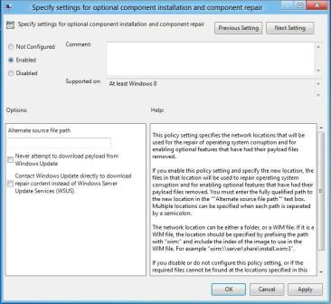

---
author:kpacquer
Description: 'Deploy .NET Framework 3.5 by using Group Policy Feature on Demand setting'
ms.assetid: 764f765d-cdc1-4638-9035-64f3d6a43b8d
MSHAttr: 'PreferredLib:/library/windows/hardware'
title: 'Deploy .NET Framework 3.5 by using Group Policy Feature on Demand setting'
ms.author:kenpacq
ms.date: 05/02/2017
ms.topic: article
ms.prod: windows-hardware
ms.technology: windows-oem
---

# Deploy .NET Framework 3.5 by using Group Policy Feature on Demand setting

For environments that use Active Directory and Group Policy, the Feature on Demand (FoD) policy setting option provides the most flexibility for the installation of .NET Framework 3.5. This Group Policy setting specifies the network locations to use to enable optional features that have had their payload files removed, and for file data and registry repair operations from failed update installations. If you disable or do not configure this setting, or if the required files cannot be found at the locations that are specified in this policy setting, the files are downloaded from Windows Update (if this is allowed by the policy settings for the computer). The Group Policy setting **Specify settings for optional component installation and component repair** is located at **Computer Configuration\\Administrative Templates\\System** in Group Policy Editor.

## Requirements

-   Active Directory Domain infrastructure that supports Windows 8 and Windows Server® 2012

-   Access rights to configure Group Policy

-   Target computers need network access and rights to use alternate sources, or an Internet connection to use Windows Update

**Figure 1 Group Policy Setting for Features on Demand and Feature Store Repair**

When this policy is enabled, a network location (for example, a file server) can be specified for both repair of the feature file store, and to enable features that have their payload removed. The **Alternate source file path** can point to a **\\sources\\sxs** folder or a Windows image (WIM) file using the WIM: prefix. The advantage of a WIM file is that it can be kept current with updates, and provide a current repair source and .NET Framework 3.5 binaries. The repair WIM can be different than the initial WIM file that is used for installation. The user or process that tries to enable an optional Windows feature requires appropriate access rights to file shares and/or WIM files.

If you select **Never attempt to download payload from Windows Update**, Windows Update is not contacted during an installation or repair operation.

If you select **Contact Windows Update directly to download repair content instead of Windows Server Update Services (WSUS)**, any attempt to add features (for example, .NET Framework 3.5) or repair the feature file store, uses Windows Update to download files. Target computers require Internet and Windows Update access for this option.

**Note**  
Windows Server Update Services (WSUS) is not supported as a source for FoD or feature file store repair.

For Windows 8 and Windows Server 2012, WSUS is not supported as a source for feature installation (for example, adding .NET Framework 3.5 feature files) or feature file store repair operations. WSUS core scenarios include centralized update management and patch management automation, which enables administrators to manage the distribution of updates that are released through Microsoft Update to computers in their network. FoD and feature file store repair rely on download of individual files to perform update or repair operations. For example, if a single file becomes corrupted, then only that file (which could be as small as a few kilobytes) is downloaded from the repair source. WSUS can use either full or express files to perform servicing update operations; however, these files are not compatible with FoD or feature file store repair.

 

If an alternate source path is used to repair images, consider the following guidelines:

-   **Servicing updates**

    Keep any repair source current with the latest servicing updates. If you are using an image from a WIM file for FoD, you can use the Deployment Image Servicing and Management (DISM) tool to service the image. For more information, see [Mount and Modify an Image Using DISM](http://go.microsoft.com/fwlink/p/?linkid=329973). If you are using an online Windows installation that is shared on your local network as a repair image, make sure that the computer has access to Windows Update.

-   **Multilingual images**

    You must include all relevant language packs with your repair source files for the locales that your image supports. If you restore a feature without all localization files that the Windows installation requires for that feature, installation fails. You can install additional language packs after a feature is restored.

## Related topics

[Microsoft .NET Framework 3.5 Deployment Considerations](microsoft-net-framework-35-deployment-considerations.md)

 

 

