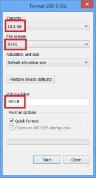

# Get the tools needed to customize Windows

Here's what you'll need to start testing and deploying devices:

## PCs

Here's how we'll refer to them:

-   **Technician PC**: Your work PC. This PC should have at least 15GB of free space for installing the [Windows Assessment and Deployment Kit (Windows ADK)](http://go.microsoft.com/fwlink/?LinkId=526803) and working with Windows images. 

    We recommend using Windows 10 for this PC. The minimum requirement is Windows 7 SP1, though this requires additional tools or workarounds for tasks such as running PowerShell scripts and mounting .ISO images.

    For most tasks, you can use either an x86 or x64 PC. If you're creating x86 images, you'll need an x86-based PC (or virtual machine) for a one-time task of [generating a catalog file](update-windows-settings-and-scripts-create-your-own-answer-file-sxs.md) when you modify your answer file with Windows SIM.

-   **Reference PC**: A test PC or tablet that represents all of the devices in a single model line; for example, the *Fabrikam Notebook PC Series 1*. This device must meet the Windows 10 minimum hardware requirements.

    You'll reformat this device as part of the walkthrough.

## Storage

-   One **USB key** that you'll format with two partitions. The USB key must be at least 16GB. This drive will be formatted, so save your data off of it first. It shouldn't be a Windows-to-Go key or a key marked as a non-removable drive.

Here's how to format your USB key with two partitions. The first partition will be formatted FAT32 and called *WinPE*. We'll use this partition to boot to WinPE. The second partition will be called *USB-B*. We'll use this drive to store your Windows images and other customizations that we'll use throughout this lab.

From the Command Prompt:

```
diskpart
list disk
select <disk number>
clean
rem === Create the Windows PE partition. ===
create partition primary size=2000
format quick fs=fat32 label="WinPE"
assign letter=P
active
rem === Create a data partition. ===
create partition primary
format fs=ntfs quick label="USB-B"
assign letter=O
list vol
exit
```
> [!Note]
> You can use two separate USB drives for this lab. If you decide to use two drives, format one as FAT32 and one as NTFS.

## Software

Create a folder called on the technician PC called `C:\temp\lab`. When working with images, use local storage rather than external sources like network shares or removable drives. This reduces the risk of interrupting the build process from a temporary network issue or from disconnecting the USB device.

To complete this guide, get the recommended downloads in this section from <https://www.microsoftoem.com>. 

The version numbers of the Windows ADK, the Windows image you're deploying, and the languages and features you're adding must match.

This lab only gives examples for building 64-bit systems. If you're working with a 32-bit image, replace the mentions of 64-bit with 32-bit.

Download the following, and place the files into `C:\temp\lab`.

### The most recent version of Windows 10


|                                                      |
| ---------------------------------------------------- |
| Windows Home 10, 64-bit English OPK      |


#### Customizations: Windows updates, languages, features, apps, and Microsoft Office

|                                                                  |
| ----------- |
|              Win 10 32/64 MultiLang OPK LangPackAll/LIP     |
|              Win 10 32/64 MultiLang OPK Feat on Demand      |
|              Win 10 32/64 MultiLang OPK App Update          |
|  Latest Office OPK                       |
| 2 Microsoft Store signed apps, if you have them |


### Windows Assessment and Deployment Kit (ADK) for Windows 10

Download the version of [Windows ADK for Windows 10](https://docs.microsoft.com/en-us/windows-hardware/get-started/adk-install#winADK) that matches the version of Windows 10 you are working with.

### Drivers

We also discuss how to add hardware drivers and other Windows apps in this guide. If you need to add additional drivers to your image, you'll need to contact your hardware or software manufacturers.

### Sample files

Download the lab samples from [USB-B.zip](https://go.microsoft.com/fwlink/?linkid=872894), and extract the files to the _USB-B_ drive. 

- The deployment steps in this guide depend on the sample configuration files included in USB-B. You can download USB-B.zip from the Microsoft Download Center.

- The contents of the configuration files included in USB-B are examples that you may change according to your branding and manufacturing choices. However, file names and hierarchy of the folders and files must be the same as demonstrated below in order to align your deployment procedure with this guide.

**Note**: _USB-B_ has to be formatted as NTFS.

 


## Product keys

Get the default product keys for each Windows version from the Kit Guide Windows 10 Default Manufacturing Key OEM PDF, which is on the ISO with the Windows image.

Get the distribution product keys that match the Windows 10 image.
