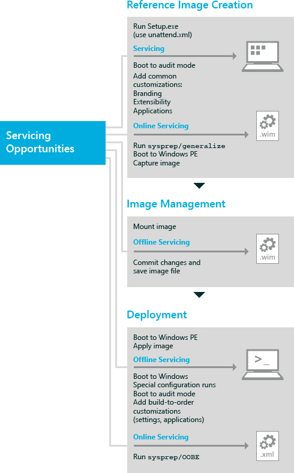

# Understanding Servicing Strategies

You can service, or make changes to, a Windows image at various phases of deployment in the following ways: offline, during an automated installation, or online. The phase of deployment that you select depends on your deployment strategy.

[Offline Servicing](#offlineservicingstrategy): Allows you to add and remove updates, drivers, language packs, and configure other settings without booting Windows. Offline servicing is an efficient way to manage existing images that are stored on a server because it eliminates the need for re-creating updated images. You can perform offline servicing on an image that is mounted or applied to a drive or directory.

[Servicing an Image by Using Windows Setup](#servicingdeploymentstrategy): Enables you to provide an answer file (Unattend.xml) that Windows Setup uses to make changes to your image at the time of deployment. The answer file contains specific servicing operations such as adding drivers, updates, language packs, and other packages. Servicing an image during an automated installation can be easily implemented and is ideal for Setup-based deployment.

[Servicing a Running Operating System](#onlineservicingstrategy): Also known as online servicing, this method involves booting to audit mode to add drivers, applications, and other packages. Online servicing is ideal for drivers when the driver packages have co-installers or application dependencies. It is also efficient when most of your servicing packages have installers, or the updates are in .msi or KB.exe file formats, or the applications rely on Windows installed services and technologies (such as the .NET Framework or full Plug and Play support).

The following illustration shows the servicing opportunities available during the various phases of deployment.

## Offline Servicing

Offline servicing was introduced with Windows Vista. Offline servicing occurs when you modify or service a Windows image entirely offline without booting it first. For Windows Vista, the Package Manager command-line tool was provided for updating Windows images. In Windows 7 and Windows 8, Deployment Image Servicing and Management (DISM) replaces Package Manager. For Windows 8 and later, most operating system servicing operations can be performed on an offline Windows image by using the DISM command-line tool. DISM is installed with Windows starting with Windows 8, and is also distributed in the Windows Assessment and Deployment Kit (Windows ADK). For more information about DISM, see [DISM - Deployment Image Servicing and M\\anagement Technical Reference for Windows](dism---deployment-image-servicing-and-management-technical-reference-for-windows.md).

DISM can be used on an offline image to:

-   Mount, remount, and unmount an image in a .wim file for servicing.

-   Query information about a Windows image.

-   Add, remove, and enumerate drivers provided as .inf files.

-   Add, remove, and enumerate packages, including language packs, provided as .cab files.

-   Add .msu files.

-   Configure international settings.

-   Enable, disable, and enumerate Windows operating system features.

-   Upgrade to a higher edition of Windows.

-   Check the applicability of a Windows Installer application patch (.msp file).

-   Enumerate applications and application patches installed in a Windows image.

-   Add siloed provisioning packages to an applied image.

-   Apply the offline servicing section of an unattended answer file.

-   Update a Windows Preinstallation Environment (Windows PE) image.

For more information about how to service a mounted image, see [Service a Mounted Windows Image](service-a-mounted-windows-image.md).

For more information about how to service an applied image, see [Service an Applied Windows Image](service-an-applied-windows-image.md).

## Servicing an Image by Using Windows Setup

Use an unattended answer file with Windows Setup to service an image during the various configuration passes of Windows Setup. The answer file contains all the settings that are used to configure and update the Windows image. Setup calls the answer file multiple times during the deployment process. After the operating system is installed, you can boot to audit mode or Windows Welcome. For more information about Windows Setup, see [Windows Setup Technical Reference](windows-setup-technical-reference.md). For more information about configuration passes, see [Windows Setup Configuration Passes](windows-setup-configuration-passes.md).

An unattended answer file can be used during setup to:

-   Add or remove a language pack.

-   Configure international settings.

-   Add and remove drivers.

-   Add and remove packages.

-   Enable and disable Windows operating system features.

## Servicing a Running Operating System

There are several tools that can be used to service a running operating system (also known as servicing an online image). You should boot to audit mode to add updates to your Windows image. Audit mode does not require settings in Windows Welcome to be applied, allowing quicker access to the desktop. After you have booted to audit mode, you can add Plug and Play device drivers, install applications and system components, and test the validity of the installation. For more information about how to use audit mode, see [Boot Windows to Audit Mode or OOBE](boot-windows-to-audit-mode-or-oobe.md).

The following tools are typically used to update a running Windows operating system:

-   Use DISM to enumerate drivers, international settings, packages, and features, and to apply unattended answer file settings. For more information, see [DISM - Deployment Image Servicing and Management Technical Reference for Windows](dism---deployment-image-servicing-and-management-technical-reference-for-windows.md).

-   Use DPInst to add drivers for detected hardware. For information about DPInst and other tools available in the Windows Driver Kit (WDK), see [Download kits and tools for Windows](http://go.microsoft.com/fwlink/?LinkId=89603).

-   Use PNPUtil to add, remove, and enumerate drivers. For more information, see [Use PnPUtil at a command line to install a Plug and Play device](http://go.microsoft.com/fwlink/?LinkId=139151).

-   Use Windows Update Stand-Alone Installer to add service packs or other .msu files. For more information, see [Description of the Windows Update Stand-alone Installer (Wusa.exe) and of .msu Files in Windows](http://go.microsoft.com/fwlink/?LinkId=90850)

-   Use LPKSetup to add or remove language packs.

## Related topics

[Deployment Image Servicing and Management (DISM) Best Practices](deployment-image-servicing-and-management--dism--best-practices.md)

[DISM - Deployment Image Servicing and Management Technical Reference for Windows](dism---deployment-image-servicing-and-management-technical-reference-for-windows.md)

 

 

