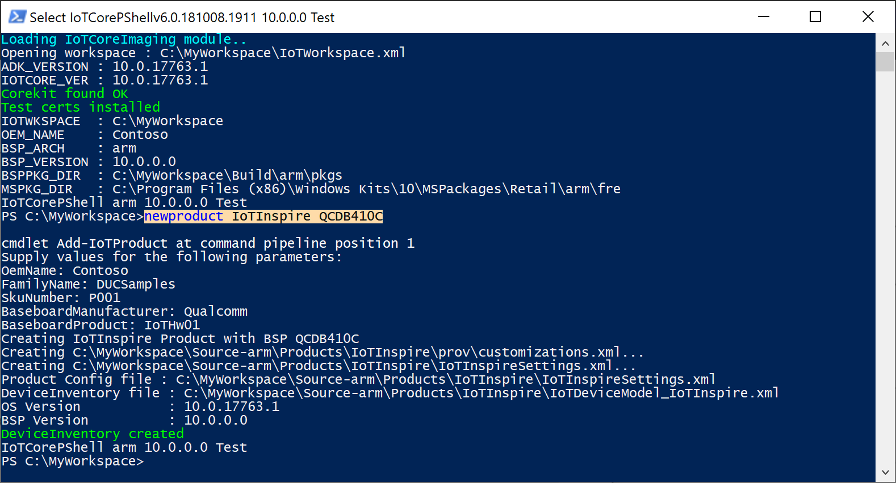
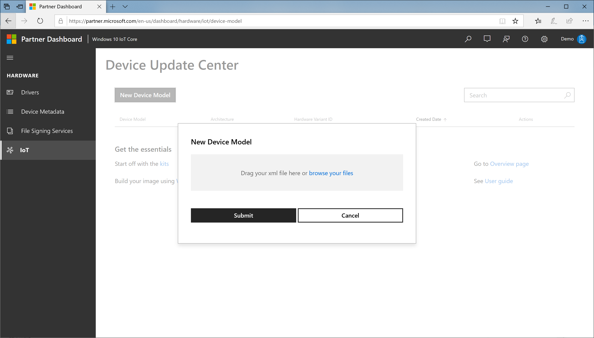
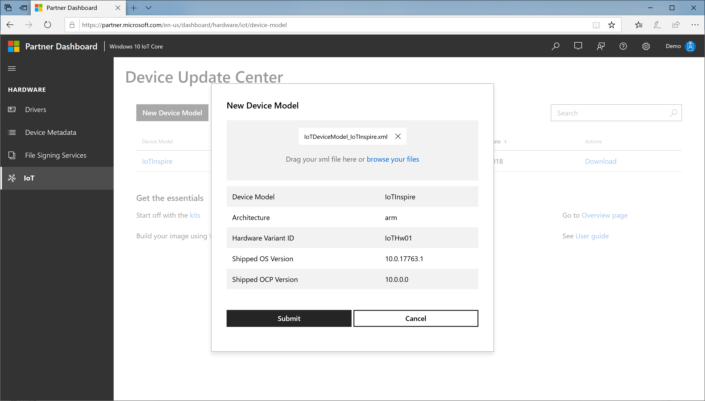
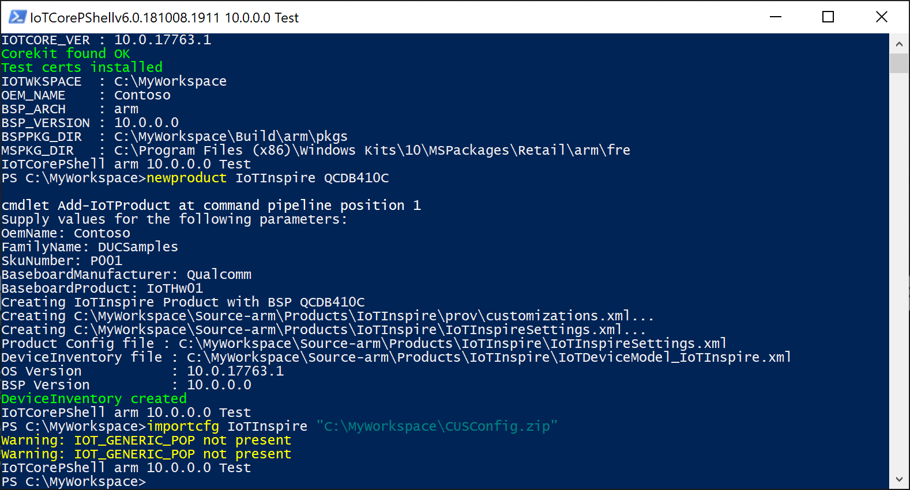
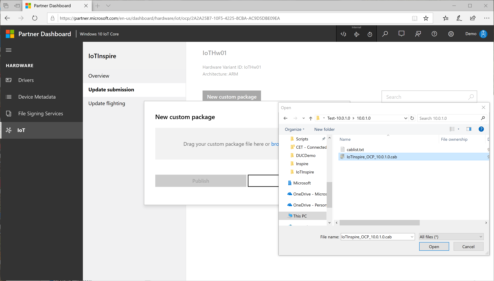

# Device Update Center User Guide

Device Update Center portal provides OEMs a way to:

- Publish OEM custom packages(OCP) to Windows Update Cloud
- Flight OEM custom packages to their devices based on flight rings
- Flight OS updates to their devices based on flight rings

## Step 1: Get set up

### Sign up 

1. Create a [Windows Hardware Dev Center account](http://aka.ms/ducregister) to access the Device Update Center(DUC). You will need:

   - **An Extended Validation (EV) code signing certificate**: Used to validate the update cab file submitted for updates
   - **An Azure Active Directory (AAD) account with administrator rights**: Used to sign legal agreements

   See [Register for the Hardware Program](https://docs.microsoft.com/windows-hardware/drivers/dashboard/register-for-the-hardware-program) for the detailed instructions on the registration process. 

2. Sign up for [Windows 10 IoT Core Services](http://aka.ms/iotcoreservices)

3. Login to Hardware Dev Center with the administrator role and specify roles for other users in your organisation. You will need:

    - **Driver Submitter** role for update submission
    - **Shipping Label Owner** role for update flighting 
  
   See [Managing User Roles](https://docs.microsoft.com/windows-hardware/drivers/dashboard/managing-user-roles) for detailed instructions.

### Install the tools

1. [Windows Assessment and Deployment Kit(Windows ADK)](https://developer.microsoft.com/windows/hardware/windows-assessment-deployment-kit)
2. [IoT Core ADK Add-Ons](https://github.com/ms-iot/iot-adk-addonkit/)
3. [Windows 10 IoT Core Packages](https://www.microsoft.com/software-download/windows10iotcore)
4. Get BSP for your platform from the silicon vendor. See [Windows 10 IoT Core BSP](https://docs.microsoft.com/windows-hardware/manufacture/iot/bsphardware)

### Set up your environment

1. Launch IoTCorePShell (launches an elevated command prompt), and create/open your workspace
    ```powershell
    new-ws C:\MyWorkspace <oemname> <arch>
    (or) 
    open-ws C:\MyWorkspace
    ```
    Note that the initial version of the OEM Custom package is set to 10.0.0.0.
2. Configure the EV certificate used in the Device Update Center and the code signing certificate in the Workspace. 

    ```xml
    <!--Specify the retail signing certificate details, Format given below -->
    <RetailSignToolParam>/s my /i "Issuer" /n "Subject" /ac "C:\CrossCertRoot.cer" /fd SHA256</RetailSignToolParam>
    <!--Specify the ev signing certificate details, Format given below -->
    <EVSignToolParam>/s my /i "Issuer" /n "Subject" /fd SHA256</EVSignToolParam>
    ```
   You can use the same EV cert used for Hardware Dev Center or get a different one for code signing purpose only. It is recommended to keep a separate certificate for each purpose.

## Step 2: Create a new product

1. Create a new product using [Add-IoTProduct](https://github.com/ms-iot/iot-adk-addonkit/blob/master/Tools/IoTCoreImaging/Docs/Add-IoTProduct.md)

    ```powershell
    Add-IoTProduct <productname> <bspname>
    (or) newproduct <productname> <bspname>
    ```

2. Provide the SMBIOS information when prompted. For Qualcomm, this is stored in a SMBIOS.cfg file. For other platforms, you will have to update the BIOS to reflect these values.

    See [OEM License Requirements](https://docs.microsoft.com/windows/iot-core/commercialize-your-device/oemlicenserequirements) for the mandatory SMBIOS fields. The key fields used in the update are: 

   - **System Product Name**, referred in the update portal as **Device Model**.

   - **Base Board Product**, referred in the update portal as **Hardware Variant ID**.

   Note that `IoTDeviceModel_<productname>.xml` is also created. This is used to register the device model in the next step.

   


## Step 3: Register Device Model in Device Update Center


1. In the Device Update Center portal, select **New Device Model**.

    

2. Browse your files and select the `IoTDeviceModel_<productname>.xml` from your workspace.

    

3. Confirm the device model specification and press **Submit**.

    

    A new device model entry will be added to device model table. You will also see a **download** link in that table.

4. Download the zip file (CUSConfig.zip) 

### Build a base image for the device
 
1. In the IoTCoreShell, import the config file using [Import-IoTDUCConfig](https://github.com/ms-iot/iot-adk-addonkit/blob/master/Tools/IoTCoreImaging/Docs/Import-IoTDUCConfig.md)

    ```powershell
    Import-IoTDUCConfig <productname> "C:\Downloads\CUSConfig.zip"
    (or) importcfg <productname> "C:\Downloads\CUSConfig.zip"
    ```

   This will also edit the OEMInputXML files for the inclusion of required FM files and feature IDs. This also removes **IOT_GENERIC_POP** feature if present.

   

2. Sign all required binaries with the code signing certificate using [Add-IoTSignature](https://github.com/ms-iot/iot-adk-addonkit/blob/master/Tools/IoTCoreImaging/Docs/Add-IoTSignature.md) and [Redo-IoTCabSignature](https://github.com/ms-iot/iot-adk-addonkit/blob/master/Tools/IoTCoreImaging/Docs/Redo-IoTCabSignature.md)

    ```powershell
    # enable retail signing
    Set-IoTRetailSign On
    (or) retailsign On
    # sign all binaries in the workspace
    Add-IoTSignature C:\MyWorkspace *.sys,*.dll,*.exe
    (or) signbinaries C:\MyWorkspace *.sys,*.dll,*.exe
    # re-sign prebuilt bsp cabs if applicable
    Redo-IoTCabSignature <srcbspdir> <dstbspdir>
    ```

3. Build the base image using the below commands

    ```powershell
    # build all packages
    buildpkg All
    # build the image
    buildimage <productname> <retail/test>
    # build recovery image, if recovery mechanism needed
    buildrecovery <productname> <retail/test>
    ```
    This gives you the base image with the OEM custom package version 10.0.0.0.

4. Validate this image on the device.

## Step 4: Publish updates

So far, we have created an updateable image which can be used to manufacture and ship the devices. In this step, we will look at the procedure of creating update packages and publishing it in the portal.

### Create update packages

1. Update the version number first using [Set-IoTCabVersion](https://github.com/ms-iot/iot-adk-addonkit/blob/master/Tools/IoTCoreImaging/Docs/Set-IoTCabVersion.md)

    ```powershell
    Set-IoTCabVersion <a.b.c.d>
    (or) setversion <a.b.c.d>
    ```
    Make sure that a.b.c.d is higher version than the previous version set.

2. If new versions of BSP drivers are available, copy them to the BSP folder setup earlier (example, `C:\BSP`). Alternatively, keep all the updated drivers in a different folder, for example, `C:\BSPv2` and update your workspace xml.

3. If there is an new version of the existing appx, create new appx with the same name. Note that the ID in the generated customizations.xml will be the same as the earlier version.

4. If updated versions of drivers are available, update both the binaries and the packaging xml file.

5. Update any other package contents as applicable.

6. Sign all required binaries with the code signing certificate using [Add-IoTSignature](https://github.com/ms-iot/iot-adk-addonkit/blob/master/Tools/IoTCoreImaging/Docs/Add-IoTSignature.md) and [Redo-IoTCabSignature](https://github.com/ms-iot/iot-adk-addonkit/blob/master/Tools/IoTCoreImaging/Docs/Redo-IoTCabSignature.md)

    ```powershell
    # enable retail signing
    Set-IoTRetailSign On
    (or) retailsign On
    # sign all binaries in the workspace
    Add-IoTSignature C:\MyWorkspace *.sys,*.dll,*.exe
    (or) signbinaries C:\MyWorkspace *.sys,*.dll,*.exe
    # re-sign prebuilt bsp cabs if applicable
    Redo-IoTCabSignature <srcbspdir> <dstbspdir>
    ```

7. Build the update image using the below commands

    ```powershell
    # build all packages
    buildpkg All
    # build the image
    buildimage <productname> <retail/test>
    # build recovery image, if recovery mechanism needed
    buildrecovery <productname> <retail/test>
    ```
   This gives you the base image with the OEM custom package version \<a.b.c.d\>.

8. Validate this image on the device to make sure the device boots with all updates included.

9. After successful validation of the update build, export the required packages using [Export-IoTDUCCab](https://github.com/ms-iot/iot-adk-addonkit/blob/master/Tools/IoTCoreImaging/Docs/Export-IoTDUCCab.md)

    ```powershell
    Export-IoTDUCCab <productname> <retail/test>
    (or) exportpkgs <productname> <retail/test>
    ```
   `<productname>_OCP_<version>.cab` will be created in the `<workspacedir>\Build\<arch>\<productname>\<config>\<version>\` folder along with `<productname>_OCP_pkgver.txt` file that lists the cabs included along with their version information.

   - If you are using different code signing cert for the packages, resign this cab file with the EV cert registered with the portal: `sign.cmd <cert attributes> <productname>_OCP_<version>.cab`

### Publish updates

1. In the Device Update Center portal, select the Device Model in the Device Model table

2. Select **Update submission** > **New custom package**

   

3. Browse your files and select the `<productname>_OCP_<version>.cab` from your workspace.

   
  
4. Confirm the release version information and press **Publish**.

   The release submission goes through a process consisting of:

   - Validation : checking the contents of the uploaded package for authenticity and correctness

   - Sign : signs the cabs with microsoft certificate for publishing to Windows Update

   - Publish : Actual publish step to Windows Update

   - Finalize : Finalizing the publishing process

5. You can check the status of the publishing process by clicking **Status** link. This process takes some time to complete.

   

## Step 5: Targeting updates

After successfully publishing the updates, you can now control the delivery process by specifying the targeting rules. 

1. Select **Update flighting** and select **New Flight**

   

2. In the New Flight dialog:

   

   a. Specify the ring (`Preview` / `EarlyAdopter` / `GeneralAvailability`), for example, Preview. Note that the xml file that is downloaded and included in the image, sets this value to *GeneralAvailability* by default

      - **Preview** ring: updates a limited set of devices, mostly in the lab

      - **EarlyAdopter** ring: updates a moderate number of devices in the user environment, including self-host devices

      - **GeneralAvailability** ring: updates every device in the market

   b. Select the OS version box if you want to specify new OS version and then select the required OS version

   c. Select the OEM custom package version box if you want to specify new OEM custom package version and then select the required OEM custom package version, for example, a.b.c.d

   d. Select **Next**

3. In the *Confirm Flighting* dialog, Select **Publish**. The targeting submission goes through a process consisting of

   - Validation : verifying the correctness of the targeting rules

   - Targeting : actual configurations set on the Windows Update

   - Finalize : finalizing the targeting process

4. You can check the status of the publishing process by clicking **Status** link.

   

   At this point the Windows Update system is set to deliver the required update packages to the device. It can take few hours before the settings are propogated.

## Step 6: Validate the updates on device

Now that the updates are available on the Windows update, you can validate the updates on the device now. The rings are provided to enable staged roll-out of the updates, starting with Preview, then EarlyAdopter, then GeneralAvailability. 

1. Configure your device to Preview Ring. This can be set using the [Azure DM API](https://github.com/ms-iot/iot-core-azure-dm-client/blob/master/docs/windows-update-management.md) 

2. Let the device scan for update, the device will detect the published update, download and install automatically (based on the update policies configured). 

   This process may take 24 hours or more depending on the scan time and active hours settings.
