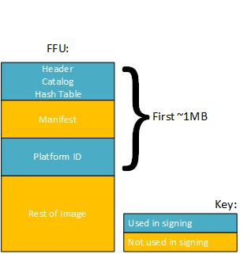

# FFU Catalog Signing


The tools that have been created to simplify the engineering and manufacturing processes provision a Microsoft certificate to the PK (Platform Key) store in UEFI. This enables Microsoft to sign the image. OEM partners provision their own certificates to the PK cert store to enable the OEM to sign the FFU.

An OEM can also sign FFUs if the OEM writes their own UEFI tool to provision the signing root/intermediate to the PK store. However, this is not recommended because it introduces complexity and security risk for both you and Microsoft in part because building and maintaining UEFI tools and the maintenance of code signing certificates and infrastructure is complex. This is especially true for small or new OEMs, as a leaked private key would allow arbitrary entities to sign FFUs that can be loaded onto the QRD OEM's device and you would still have to communicate with Microsoft for all other signing.

Therefore, to reduce the complexity and simplify the FFU catalog signing process, the ingestion client has been updated with new functionality to support retail signing of FFU catalogs.

## <span id="OEM_Verification"></span><span id="oem_verification"></span><span id="OEM_VERIFICATION"></span>OEM Verification


An FFU catalog signed for OEM. A would be a valid FFU catalog for OEM B’s devices because the intermediate certificate Microsoft provisions to the PK store is a single intermediate certificate. This is referred to as a cross-pollination risk. Therefore, to prevent images created by one OEM from being flash-able onto another OEM's devices intentionally or by accident, the mechanism used to sign FFU catalogs in the latest release of the ingestion client will be handled differently than the mechanism used to sign other packages. OEM validation will occur during signing by inspecting the metadata associated with the FFU catalog in the submission. The OEM ID contained in the catalog will be verified against OEM ID of the submission. If the values do not match, the FFU catalog signing request will be rejected. Furthermore, the Ingestion Client will verify the integrity of the catalog by checking hash values passed in with the FFU catalog metadata. The diagram below depicts the FFU catalog and the associated metadata that will be used for this verification:



For example, after you have completed initial testing on a new image, the image must be tested on a retail device. You create an FFU image for flashing, and the FFU catalog must be retail signed by Microsoft before the image can be flashed to a retail device. Use the ingestion client's `Initialize-FirmwareSubmission` cmdlet with `-TypeOfSubmission FfuCatalog`, specifying the location of the FFU image. The ingestion client will extract the FFU catalog and associated metadata from the FFU image and pass that to Microsoft to be retail signed. Code signing validates the integrity of the FFU catalog and checks the OEM ID of the catalog against the OEM ID of the account that you submitted the signing request through. As long as the OEM ID of the FFU catalog matches the OEM ID of the account of the signing request Microsoft will process and sign the FFU catalog. Once complete, you can use the `Get-SignedFirmwareSubmission` cmdlet to obtain the retail signed FFU catalog before re-integrating the signed catalog back into the FFU image so it can be flashed to a device for testing.

## <span id="FFU_Catalog_Signing_Example"></span><span id="ffu_catalog_signing_example"></span><span id="FFU_CATALOG_SIGNING_EXAMPLE"></span>FFU Catalog Signing Example


To prepare an FFU catalog to be signed:

```
PS> Initialize-FirmwareSubmission -TypeOfProduct WindowsPhoneBlue -TypeOfSubmission FfuCatalog -UpdateHistoryPath c:\input\UpdateHistory.xml -OemInputPath c:\input -OutputFilePath c:\output -FfuPath c:\input\flash.ffu
```

 

 


