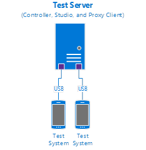
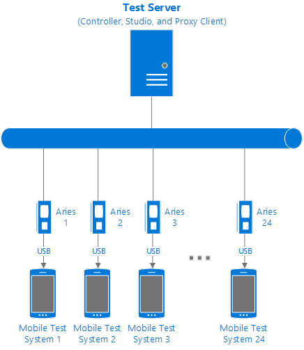
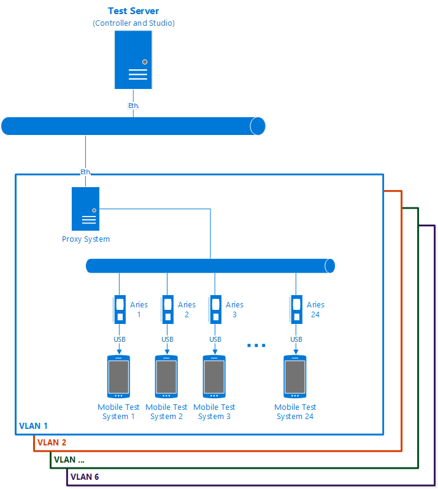

# HLK Proxy Client Prerequisites

>[!WARNING]
>  The Windows Hardware Lab Kit should only be installed on machines that are dedicated solely for testing purposes. Do not install any HLK component on a machine that is outside of a dedicated testing environment.

Before you begin testing, make sure that the test environment meets the necessary requirements. 

-   A Battery Blank is required for Aries mobile testing in this release. For more information, see [Battery Blank Information Guide](battery-blank-information-guide.md).

-  Controller setup will fail if .NET Framework 4.5 has not previously been installed. Be sure to install .NET Framework 4.5 from the following location prior to controller setup.
    <https://www.microsoft.com/net/download/framework>

- Proxy setup will fail if .NET Framework 4.6 has not previously been installed. .NET 4.6 is included with Windows 10 but must be installed separately on other versions of Windows. You can download .NET 4.6 from the following location:
    <https://www.microsoft.com/net/download/framework>

- 32-bit SQL Server installations are not supported. You must uninstall any 32-bit SQL Server installation prior to installing the HLK.

- SQL Server 2014 is not supported. You must uninstall any SQL Server 2014 installations prior to installing the HLK.

## Testing Environment

The Windows HLK Mobile testing environment is comprised of three components: an HLK test server, an HLK Proxy system, and one or more test systems.

-   **HLK test server.** Often referred to as the controller, a test server has two parts: Windows HLK Controller and Windows HLK Studio. The Controller software is the engine that manages tests that are run on test systems. The Studio software is the management tool that lets you select and schedule tests against any test system connected to the test server. Controller and Studio are installed from the Windows HLK installation source. After installation, the test server contains separate installers to install a remote Windows HLK Studio, Window HLK Proxy Client and Windows HLK Client.

    One controller governs a collection of test systems through one or more Proxy systems. Controllers can manage and access only the clients that they govern.

-   **HLK Proxy system.** The Proxy system may be the same machine as the test server or a dedicated machine. The HLK Proxy client runs on the designated system and handles communication between the HLK Controller and the mobile test systems. Each Proxy system can be associated with only one test server. You can configure the HLK Proxy system by running the Windows HLK Proxy Client software installer directly from a shared network location on the test server.

-   **Test system.** Also referred to as a client, each test system can have a different configuration that's appropriate for various testing scenarios, including different hardware, operating systems, service packs, and drivers. Each test system can be associated with only one Proxy system. No configuration is required for mobile test systems.

## Deployment scenarios

There are two deployment scenarios for Windows HLK:

-   **Domain-joined environment.** In a domain-joined environment, a domain controller is present and all computers designated for Windows HLK features are joined to the same domain controller. If you plan to deploy Windows HLK in a domain-joined environment, you need a minimum of three computers: a Windows domain controller, a Windows HLK test server, and at least one Windows HLK test system. Make sure that Microsoft Active Directory is configured and running on the domain controller. Your domain controller and HLK test server cannot be on the same box.

-   **Workgroup environment.** A workgroup environment has no domain controller. If you plan to deploy Windows HLK in a workgroup, you need at least two computers: a test server and a test system joined to the same workgroup. **Don't** use the Default Administrator account. In this configuration, you must enable the Guest account.

In addition, consider how you want to organize lab resources to best use the Windows HLK. You need to determine the number of test servers and the number of test systems connecting to them. These decisions are partly influenced by the type of devices or systems that you want to test.

## Connection Types

### Direct USB

The device is connected via a USB cable, with the cable serving as the physical layer for establishing a virtualized IP connection (i.e., IP over USB). This enables devices without an Ethernet connection to present themselves to the controller as an IP endpoint.

The Direct USB connection tethering method has known reliability and manageability issues that prevent it from being used in a large-scale lab environment. Flashing is supported over USB, but power cycling must be done manually. Furthermore, standard USB ports provide power in addition to a data connection, making simulating lower-power or battery-only testing impossible. Powered USB ports are also an issue for any tests with large power requirements as the test may drain the device's battery faster than it can be charged over USB.

### Aries

Aries is a hardware connectivity component developed at Microsoft and provides the bridge between a single device and a host wishing to control the device. The device is an Ethernet-to-USB dongle that enables the at-scale mobile testing capabilities of the HLK. Mobile test systems are connected to the IP network via a 1:1 Ethernet-to-USB dongle, with the USB side connecting directly to the device target. Aries allows for independently addressable devices that can reside anywhere on the network, without a need to always be attached to the same USB port on the same HLK controller.

## Small-Scale testing

Small-Scale test infrastructures are labs testing 1 or 2 mobile devices per controller. The limiting factor with this setup is the number of unique USB host controllers on the Test Server. Only one device should be connected per host controller for best results.

The following hardware is required per 2 devices under test on a single controller:

-   Test Server (Required)

### Setup

Testing 1 or 2 devices can be achieved over USB directly. The limitation with this connection type is that power cycling is not available and accurate power testing cannot be done as USB ports are generally powered.

## Mid-Scale testing

Mid-Scale test infrastructures are labs testing 1 to 24 mobile devices per controller. The following hardware is required to support 24 devices under test on a single controller:

-   Test Server (Required)
-   Dedicated Proxy System (Optional)
-   Network Switch, 10/100 minimum (Optional)
-   1 Aries dongle per device (Required)

### Setup

Similar to the small-scale setup, the key difference in the mid-scale setup is that Aries is required for scale-out.

## Large-Scale testing

Large-Scale test infrastructures are labs testing 1 to 150 mobile devices per controller. The following hardware is required to support 150 devices under test on a single controller:

-   Test Server (Required)
-   Dedicated Proxy Systems (Required)
-   Network Switches, 10/100 minimum (Required)
-   1 Aries dongle per device (Required)

### Setup

To manage the volume of devices in this scenario and handle the bandwidth, multiple subnets are highly recommended.

## System requirements

**Test server**

<table>
<colgroup>
<col width="33%" />
<col width="33%" />
<col width="33%" />
</colgroup>
<thead>
<tr class="header">
<th>Component</th>
<th>Minimum</th>
<th>Optimum</th>
</tr>
</thead>
<tbody>
<tr class="odd">
<td>Processor</td>
<td>Single Intel or AMD-based x64 platform with a speed of 2.0 GHz</td>
<td>Multicore or multiple x64-based processors running in x64 mode with a speed of 2.0 GHz or faster</td>
</tr>
<tr class="even">
<td>System memory</td>
<td>2 GB main memory</td>
<td>4 GB main memory</td>
</tr>
<tr class="odd">
<td>Hard disk capacity</td>
<td>300 GB minimum to accommodate the volume of logs that can be generated.</td>
<td>RAID configuration</td>
</tr>
<tr class="even">
<td>Network connection</td>
<td>100 megabits per second (Mbps)</td>
<td>1 gigabit per second (Gbps)</td>
</tr>
<tr class="odd">
<td>Operating system</td>
<td>
English language and English local version of Windows Server 2008 R2 64-bit with service pack (SP1), Windows Server 2012, or Windows Server 2012 R2. For information, see the [Windows Server](http://go.microsoft.com/fwlink/?LinkId=236055) website.

<strong>Note</strong>  

Controller isn't supported on Windows Server 2003, Windows Server 2008, Windows Vista, Windows XP, or Windows 2000.

Controller isn't supported on an installation that has already been set up as a domain controller.

 

</td>
<td></td>
</tr>
</tbody>
</table>

 

**Mobile test systems**

<table>
<colgroup>
<col width="50%" />
<col width="50%" />
</colgroup>
<thead>
<tr class="header">
<th>Component</th>
<th>Minimum</th>
</tr>
</thead>
<tbody>
<tr class="odd">
<td>Processor</td>
<td>The recommended processor for the operating system that you install.</td>
</tr>
<tr class="even">
<td>System memory</td>
<td>Refer to the recommended processor for the operating system that you install.</td>
</tr>
<tr class="odd">
<td>Storage capacity</td>
<td>4 GB flash storage minimum.</td>
</tr>
<tr class="even">
<td>Operating system</td>
<td>
Windows 10 or higher.

The HLK supports Test images for general testing. Images must boot to flash mode by default.
</td>
</tr>
</tbody>
</table>

 

**Proxy system**

<table>
<colgroup>
<col width="50%" />
<col width="50%" />
</colgroup>
<thead>
<tr class="header">
<th>Component</th>
<th>Minimum</th>
</tr>
</thead>
<tbody>
<tr class="odd">
<td>Processor</td>
<td>The recommended processor for the operating system that you install.</td>
</tr>
<tr class="even">
<td>System memory</td>
<td>Refer to the recommended processor for the operating system that you install.</td>
</tr>
<tr class="odd">
<td>Hard disk capacity</td>
<td>300 GB minimum to accommodate the volume of logs that can be generated.</td>
</tr>
<tr class="even">
<td>Operating system</td>
<td><ul>
<li>Windows 8 Client</li>
<li>Windows 8.1 Client</li>
<li>Windows 10 Client</li>
<li>Windows Server 2012</li>
<li>Windows Server 2012 R2</li>
<li>Windows 7 Client</li>
<li>Windows Server 2008 R2</li>
</ul></td>
</tr>
</tbody>
</table>

 

**Optional remote/standalone Windows HLK Studio**

<table>
<colgroup>
<col width="50%" />
<col width="50%" />
</colgroup>
<thead>
<tr class="header">
<th>Component</th>
<th>Minimum</th>
</tr>
</thead>
<tbody>
<tr class="odd">
<td>Processor</td>
<td>The recommended processor for the operating system that you install.</td>
</tr>
<tr class="even">
<td>System memory</td>
<td>Refer to the recommended processor for the operating system that you install.</td>
</tr>
<tr class="odd">
<td>Hard disk capacity</td>
<td>
300 GB minimum to accommodate the volume of logs that can be generated.

The client must be unique; you can't swap drives.
</td>
</tr>
<tr class="even">
<td>Network connection</td>
<td>100 Mbps</td>
</tr>
<tr class="odd">
<td>Operating system</td>
<td><ul>
<li>Windows 10</li>
<li>Windows 8.1</li>
<li>Windows 8</li>
<li>Windows 7</li>
</ul></td>
</tr>
</tbody>
</table>