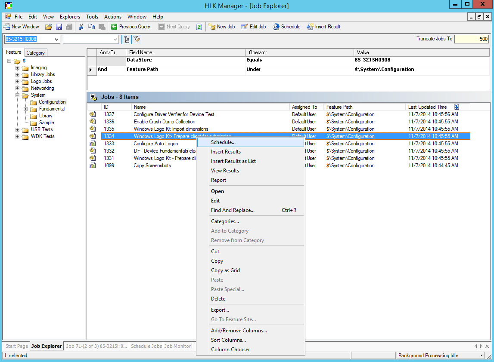
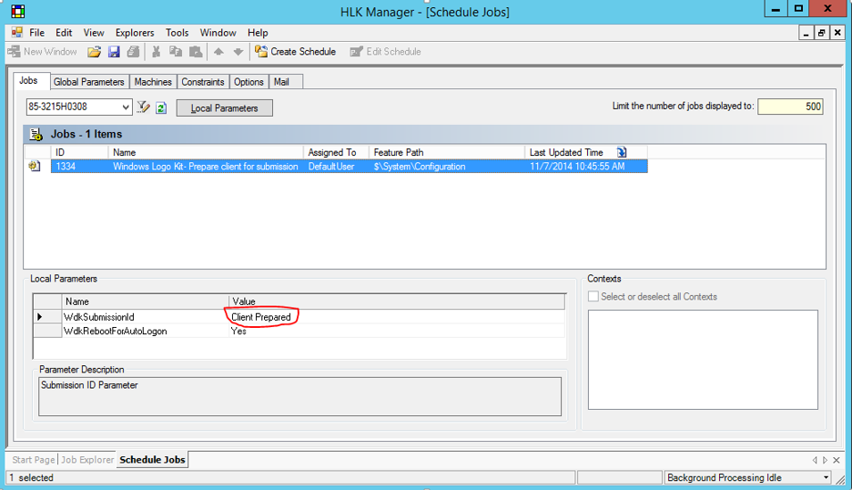
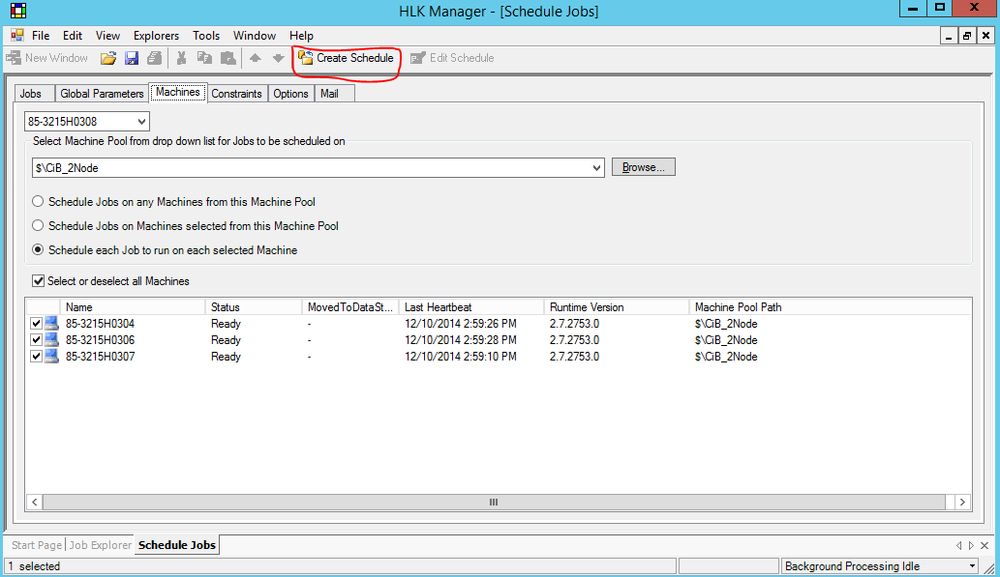
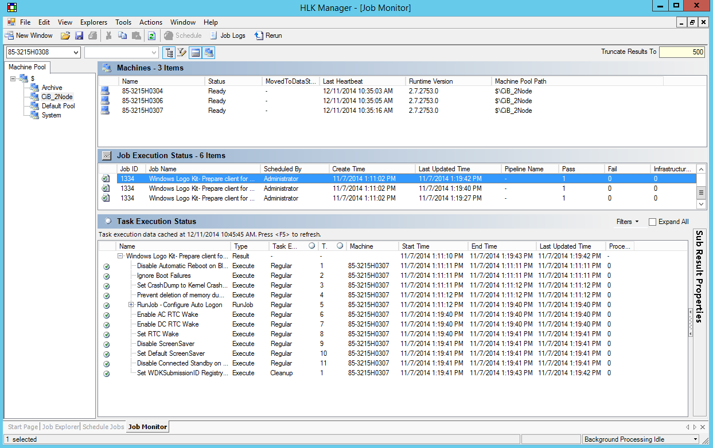
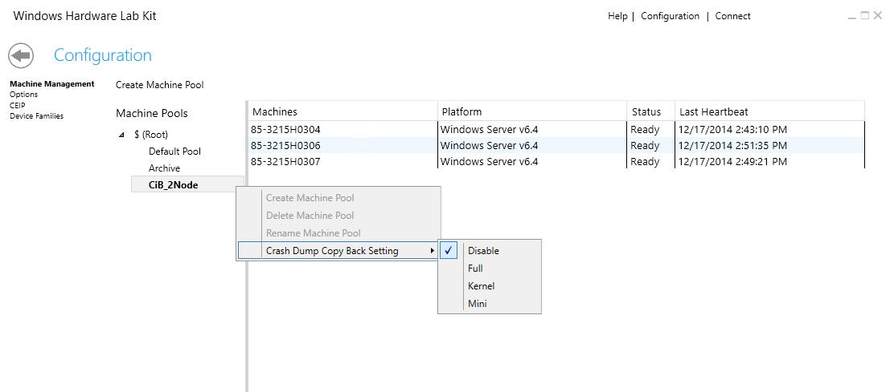
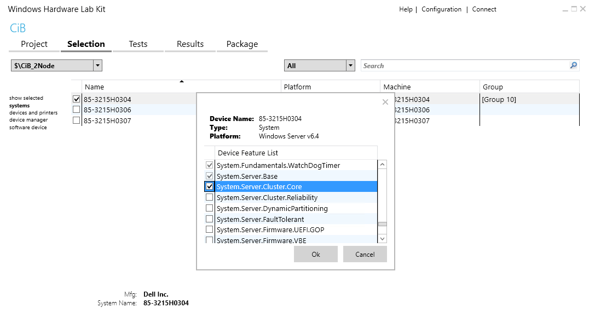
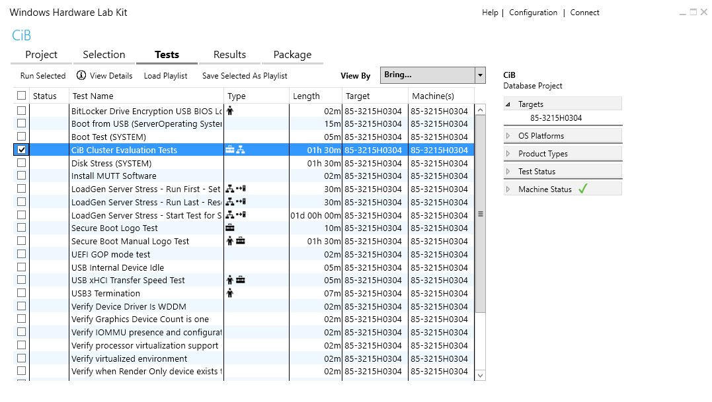
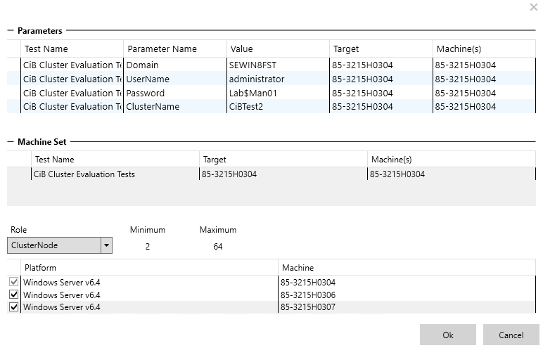
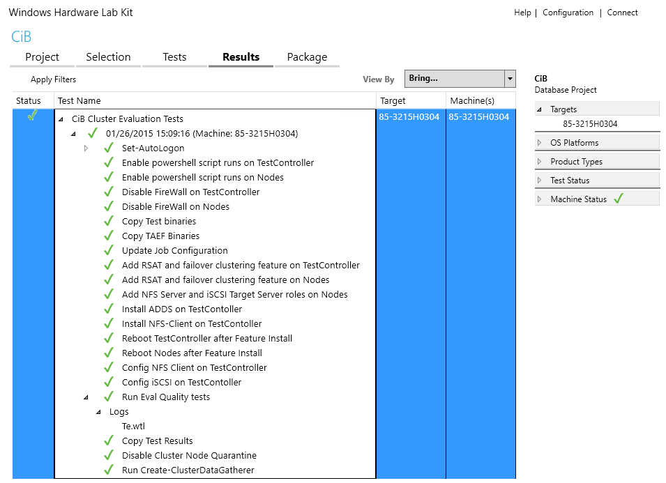
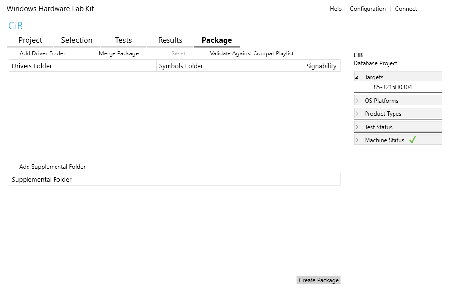

# <span id="p_hlk_test.6fa11e57-ec0a-45d4-921b-d47cf62f6c27"></span>CiB Cluster Evaluation Tests


The tests are the first part of the Cluster in A Box (CiB) Continuous Available (CA) validation tests which help validate CiB product meet the CA hardware requirements.

The tests perform the tasks below:

-   [Validate hardware for Failover Cluster](https://technet.microsoft.com/en-us/library/jj134244.aspx)
-   Create Failover Cluster
-   Setup CA File Server with SMB and NFS shares
-   Setup CA iSCSI Target Server with iSCSI virtual disks
-   Perform basic failover action and IO tests

## Test details
|||
|---|---|
| **Specifications**  | <ul><li>System.Server.Cluster.Core.ClusterInABox</li></ul> |  
| **Platforms**   | <ul><li>Windows Server 2016 (x64)</li></ul> |
| **Supported Releases** | <ul><li>Windows 10</li><li>Windows 10, version 1511</li><li>Windows 10, version 1607</li><li>Windows 10, version 1703</li><li>Windows 10, version 1709</li><li>Windows 10, version 1803</li><li>Next update to Windows 10</li></ul> |
|**Expected run time (in minutes)**| 90 |
|**Category**| Scenario |
|**Timeout (in minutes)**| 5400 |
|**Requires reboot**| false |
|**Requires special configuration**| true |
|**Type**| automatic |

 

## <span id="Additional_documentation"></span><span id="additional_documentation"></span><span id="ADDITIONAL_DOCUMENTATION"></span>Additional documentation


Tests in this feature area might have additional documentation, including prerequisites, setup, and troubleshooting information, that can be found in the following topic(s):

-   [System.Server additional documentation](system-server-additional-documentation.md)

## <span id="Running_the_test"></span><span id="running_the_test"></span><span id="RUNNING_THE_TEST"></span>Running the test


**Hardware requirements**

CiB product (up to 64 nodes) and one extra machine as test controller are required to run the test.

The following requirements on CiB nodes must be met:

-   The CiB nodes must meet the hardware requirements for Windows Server 10.
-   The CiB nodes must meet the Failover Clustering hardware requirements for Windows Server 10
-   The CiB nodes must have approximately 100 GB of free space on the local hard drive.

The following requirements on the test controller machine must be met:

-   The test controller must meet the hardware requirements for Windows Server 10.
-   At least 100 GB of free space on the local hard drive.
-   At least 32 GB of memory.
-   We recommend one 10 Gigabit Ethernet adapter.
-   At least two quad core processors.

The following shared storage requirements for CiB nodes must be met:

-   At least 22 shared LUNs (minimal 1GB each, recommend 100 GB or more each).
-   All shared LUNs are visible to all CiB nodes.
-   All shared LUNs have been initialized and formatted as NTFS volumes with appropriate drive letters.

**Software requirements**

-   All machines must be running Windows Server 10.
-   All machines must be joined to the same domain.
-   All machines must have IP addresses that are provided by DHCP
-   DNS resolution for all machines

**LMS Workaround**

In order for HLK Controller to schedule the tests on the test machines (CiB nodes and Test Controller), an HLK job needs to be run on all test machines manually via HLK Manager before running the tests. This is a one-time workaround and just need to be done once after HLK client is installed on all machines.

Steps:

Make sure HLK client has been installed on all CiB nodes and Test Controller machine. Machines has been moved to a machine pool for CiB testing and are in Ready status.

1.  Open HLK Manager by pressing the Windows key and typing **HLK Manager**
2.  Open Job Explorer by going to **Menu-&gt;Explorers-&gt;Job Explorer**
3.  Go to $\\System\\Configuration\\, and find the job named **Windows Logo Kit- Prepare client for submission**

    >[!NOTE]
    >  Press F5 if the job is not showing up

     

4.  Right click the job and then click **Schedule…**

    

5.  Under the **Jobs** tab, Set the **WDKSubmissionId** parameter to **Client Prepared**

    

    Under the **Machines** tab, find the machine pool for CiB testing, select all CiB nodes and the Test Controller machine, and then click **Create Schedule**

    

6.  Monitor the job running status

    Open Menu-&gt;Explorers-&gt;Job Monitor. Navigate to the machine pool created for CiB testing

    Wait for the job to complete on all machines.

    

7.  Open HLK Studio, go to **Configuration**, and right click the CiB machine pool. Note the **Crash Dump Copy Back Setting** value (in this example it's been set to **Disable**).

    

8.  On each of the machines run below command from an elevated command prompt to set the same Crash Dump setting as noted in step 7 (replace **Disable** in the command if setting is different).

    ``` syntax
    WTTCmd.exe /ConfigReg /Add /Value:"WHCK\CrashDumpClientSetting" /Data:"Disable"
    ```

**To start the tests, follow these steps:**

1.  Open HLK Studio
2.  Create a project
3.  Go to the **Selection** page, and select the Test Controller machine under the **systems** tab
4.  Right-click the selected target, click **Add new features**, select **System.Server.Cluster.Core**, and then click **OK**

    

5.  Go to the **Tests** page, select **CiB Cluster Evaluation Tests**, and then click **Run Selected**.

    

6.  Select all CiB nodes for ClusterNode role.

    Set appropriate parameter values for **Domain**, **UserName**, **Password** and **ClusterName**.

    >[!NOTE]
    >  ClusterName cannot exceed 9 characters. If running the test multiple times, please use a different value for the cluster name each time

     

    Click **OK** to schedule the test.

    

7.  Go to the **Results** page to check the test status and results.

    

8.  Create a package file for **CiB Cluster Evaluation tests**

    Go to the **Package** page, click **Create Package**, and then click **OK**.

    

## <span id="Troubleshooting"></span><span id="troubleshooting"></span><span id="TROUBLESHOOTING"></span>Troubleshooting


For generic troubleshooting of HLK test failures, see [Troubleshooting Windows HLK Test Failures](..\user\troubleshooting-windows-hlk-test-failures.md).

An error similar to **Cluster failure: test case \#\#\# failure** indicates that the cluster has not been properly configured. Make sure that your shared disks are initialized and formatted as NTFS volumes to ensure a cluster can be formed and that no clusters or resource groups exist with the name specified in the cluster parameter.

If failures are found, you can review the logs to get additional details about the failures in HLK Studio under the **Results** page:

-   CiB Cluster Evaluation Tests-&gt;Run Eval Quality tests-&gt;Logs-&gt;te.wtl

To view the cluster hardware validation reports, right-click the test, and select **Additional Files**

## <span id="More_information"></span><span id="more_information"></span><span id="MORE_INFORMATION"></span>More information


### <span id="Parameters"></span><span id="parameters"></span><span id="PARAMETERS"></span>Parameters

| Parameter name                     | Parameter description                                        |
|------------------------------------|--------------------------------------------------------------|
| **CiBTestBin**                     | test binary location                                         |
| **ReplaceNodeNames.ps1**           |                                                              |
| **PATHTOXML**                      |                                                              |
| **CONFIGFILENAME**                 | Name of the config XML file                                  |
| **Domain**                         | The name of the domain to which the cluster nodes are joined |
| **UserName**                       | The user name of a user in the Domain Admins security group  |
| **Password**                       | The password of the user in the Domain Admins security group |
| **ClusterName**                    | The name of the cluster to be created                        |
| **NodeList**                       |                                                              |
| **Reboot-Nodes.ps1**               |                                                              |
| **Create-ClusterDataGatherer.ps1** |                                                              |

 

 

 


