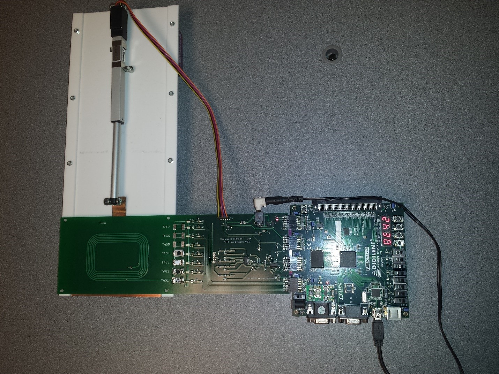
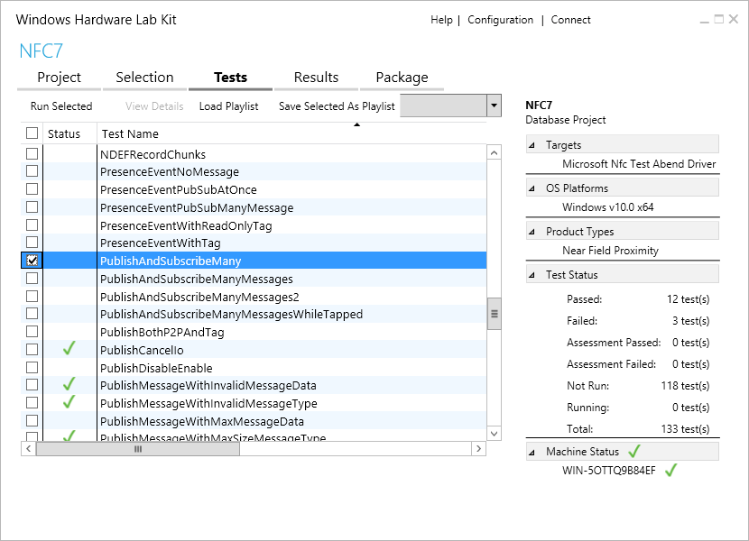
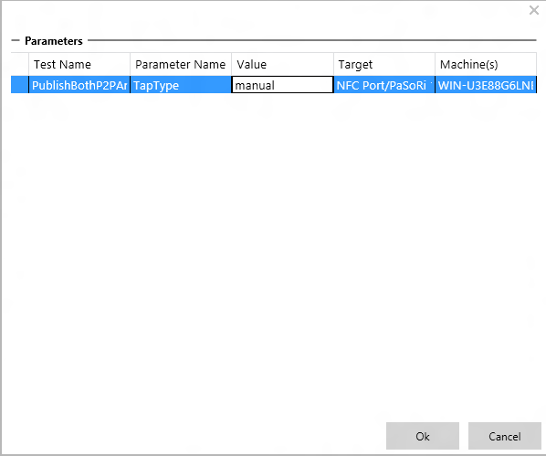

# Hardware Lab Kit (HLK) for Near Field Communication (NFC)


The HLK for NFC validates that the NFC driver implementation meets [Microsoft specifications](https://msdn.microsoft.com/en-us/library/windows/hardware/dn905575.aspx). Although the tests are able to be run manually, for automated, faster and more reliable testing for the HLK NFC test suite, we recommend that partners acquire the NFC Interoperability Test Tool (NITT).

The NITT simulates Type 1, 2, 3, and 4 NFC forum tags. The NITT has a robot arm that moves an RF shield, simulating tapping/un-tapping operations for Peer-to-Peer and Card Emulation scenarios. The following image illustrates the NITT setup.



The NITT is powered with an external power supply of 7.5v and is connected to the client PC.

To acquire the NITT, use the following contact information:

``` syntax
JJG Technologies LLC
1034 231st Pl NE
Sammamish, WA 98074 
Phone: (206) 304-1921 Fax: (208) 298-0623
inquiry@jjgtechnologies.com
```

After setting up the [HLK test framework](https://msdn.microsoft.com/en-us/library/windows/hardware/dn939963.aspx):

### <span id="Hardware_requirements"></span><span id="hardware_requirements"></span><span id="HARDWARE_REQUIREMENTS"></span>Hardware requirements

-   Device with NFC chip that implements the NFC driver DDIs and is subject to compliance tests (referred to as Device Under Test (DUT))
-   Desktop PC with USB port (PC client)
-   NITT board (if available) connected to the PC client
-   Device with NFC chip that implements the Near Field Proximity DDIs (NFC client)
-   Smart card reader connected to the PC client (either by USB or embedded in the PC client)

>[!NOTE]
>  The PC client requires the installation of the Universal C Runtime. This package is available directly from the [Microsoft Download Center](https://www.microsoft.com/en-us/download/details.aspx?id=48234).

 

### <span id="Test_execution"></span><span id="test_execution"></span><span id="TEST_EXECUTION"></span>Test execution

### <span id="Before_you_run_the_test"></span><span id="before_you_run_the_test"></span><span id="BEFORE_YOU_RUN_THE_TEST"></span>Before you run the test

-   Make sure HLK client is deployed to DUT.
-   Place the DUT on top of the NITT board NFC antenna.
-   Place NFC client or smart card reader, depending on the test being run, below the NFC antenna and the RF shield of the NITT.
-   Make sure the PC client has the Universal C Runtime installed.
-   Make sure DUT, NFC client and PC client have network connections. If the DUT or the NFC client is a phone, you will need the Virtual Ethernet tool to be able to connect to the phone.

The HLK studio/controller deploys and runs test cases on the DUT but some intervention on the tester's part is required. For test cases where manual intervention is required, the helper binaries need to be launched manually. In order to do so, the NFC and PC clients need to have the following setup:

### <span id="NFC_client"></span><span id="nfc_client"></span><span id="NFC_CLIENT"></span>NFC client

-   Create a working folder, and copy TAEF binaries corresponding to the client architecture from the HLK controller to the working directory. For a typical HLK studio setup, the TAEF binaries will be located in the following directory:

    ``` syntax
    C:\Program Files (x86)\Windows Kits\10\Testing\Runtimes\TAEF\<arch>\*\MinTE\*
    ```

    Where &lt;arch&gt; is either x86, x64, arm, arm64.

-   Copy NfcRemotePeerService.dll from the following HLK Studio location to the working directory created above:

    ``` syntax
    C:\Program Files (x86)\Windows Kits\10\Hardware Lab Kit\Tests\<arch>\NFC\NfcRemotePeerService.dll
    ```

    Where &lt;arch&gt; is either x86, amd64, arm, arm64.

### <span id="PC_client___setup_if_using_NITT_"></span><span id="pc_client___setup_if_using_nitt_"></span><span id="PC_CLIENT___SETUP_IF_USING_NITT_"></span>PC client (\*setup if using NITT)

-   Create a working folder, and copy TAEF binaries corresponding to the client architecture from the HLK controller to the working directory. For a typical HLK studio setup, the TAEF binaries will be located in the following directory:

    ``` syntax
    C:\Program Files (x86)\Windows Kits\10\Testing\Runtimes\TAEF\<arch>\*\MinTE\*
    ```

    Where &lt;arch&gt; is either x86, x64, arm, arm64.

-   Copy NfcNittController.exe from the following HLK studio location to the working directory created above:

    ``` syntax
    C:\Program Files (x86)\Windows Kits\10\Hardware Lab Kit\Tests\<arch>\NFC\NfcNittController.exe
    ```

    Where &lt;arch&gt; is either x86, amd64, arm, arm64.

-   Copy MuttUtil.dll from the following HLK studio location to the working directory created above:

    ``` syntax
    C:\Program Files (x86)\Windows Kits\10\Hardware Lab Kit\Tests\<arch>\usb\MuttTools\MuttUtil.dll
    ```

    Where &lt;arch&gt; is either x86, amd64, arm, arm64.

### <span id="PC_client___setup_if_not_using_NITT_"></span><span id="pc_client___setup_if_not_using_nitt_"></span><span id="PC_CLIENT___SETUP_IF_NOT_USING_NITT_"></span>PC client (\*setup if not using NITT)

-   Create a working folder, and copy NfcManualHelper.exe corresponding to the client architecture from the HLK controller to the working directory. For a typical HLK studio setup, NfcManualHelper.exe will be located in the following directory:

    ``` syntax
    C:\Program Files (x86)\Windows Kits\10\Hardware Lab Kit\Tests\<arch>\NFC\NfcManualHelper.exe
    ```

    Where &lt;arch&gt; is either x86, x64, arm, arm64.

### <span id="Running_the_test_using_HLK"></span><span id="running_the_test_using_hlk"></span><span id="RUNNING_THE_TEST_USING_HLK"></span>Running the test using HLK

### <span id="HLK_Studio"></span><span id="hlk_studio"></span><span id="HLK_STUDIO"></span>HLK Studio

-   In HLK studio, select the test from the "Tests" tab as per following image:

    

-   Click **Run Selected**
-   If you are running the tests manually (without the NITT) then change the Parameters value from **nitt** to **manual**, as shown in the following image:

    

### <span id="NFC_client"></span><span id="nfc_client"></span><span id="NFC_CLIENT"></span>NFC client

-   Open the command prompt, and go to the working folder created above
-   Run the following command:

    ``` syntax
    TE.exe NfcRemotePeerService.dll /p:server=<ip_of_dut>
    ```

    Where &lt;ip\_of\_dut&gt; is the IP address of the DUT

-   NfcRemotePeerService.dll will connect to the test running on the DUT and will receive commands from the test. These commands will instruct NfcRemotePeerService.dll on when to create Near Field Proximity publications and subscriptions on the NFC client. When the DUT and the NFC client are tapped together, the publications and subscriptions will fire, exercising NFC's Peer-to-Peer scenarios.

### <span id="PC_client___setup_if_using_NITT_"></span><span id="pc_client___setup_if_using_nitt_"></span><span id="PC_CLIENT___SETUP_IF_USING_NITT_"></span>PC client (\*setup if using NITT)

-   Open the command prompt, and go to the working folder created above
-   Run the following command:

    ``` syntax
    nfcnittcontroller.exe -server <ip_of_dut> -tagIndex <tag_index> -reader <reader_name>
    ```

    Where &lt;ip\_of\_dut&gt; is the IP address of the DUT, &lt;tag\_index&gt; is the NITT board tag index, and &lt;reader\_name&gt; is the name of the smart card reader connected to the PC client. Possible values of &lt;tag\_index&gt; are 1, 2, 3, and 4 corresponding to NFC Forum compliant T1T, T2T, T3T, and T4T, respectively. To find the name of the smart card reader connected to the PC client, you can use the *-listReaders* option of NfcManualHelper.exe (see below).

-   NfcNittController.exe will connect to the test running on the DUT and will receive commands from the test. These commands will instruct NfcNittController.exe on when to perform actions with the NITT. These actions are performed automatically and don't need any manual interaction. Example actions: Opening and closing the RF shield, turning on and off a tag on the NITT.

### <span id="PC_client___setup_if_not_using_NITT_"></span><span id="pc_client___setup_if_not_using_nitt_"></span><span id="PC_CLIENT___SETUP_IF_NOT_USING_NITT_"></span>PC client (\*setup if not using NITT)

-   Open the command prompt, and go to the working folder created above
-   Run the following command:

    ``` syntax
    nfcmanualhelper.exe -server <ip_of_dut> -reader <reader_name>
    ```

    Where &lt;ip\_of\_dut&gt; is the IP address of the DUT and &lt;reader\_name&gt; is the name of the smart card reader connected to the PC client. To find the name of the smart card reader connected to the PC client, you can run the following command:

    ``` syntax
    nfcmanualhelper.exe -listReaders
    ```

-   NfcManualHelper.exe will connect to the test running on the DUT and will print instructions on what to do while the test is executing. Example instructions: Tap DUT onto NFC client, tap DUT onto smart card reader, tap DUT onto Near Field Proximity tag.

 

 


