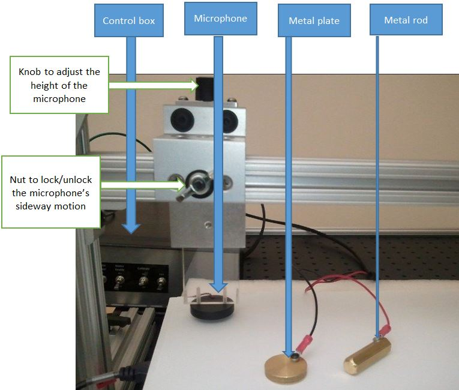
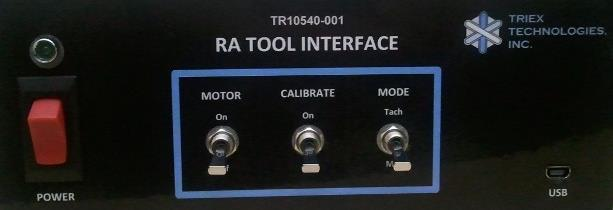
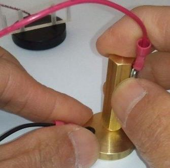

# How to measure Touch Down Latency by using an Acoustic Measurement Tool

This article describes the detailed setup and procedures to measure touch down latency of touch hardware by using an acoustic measurement tool. The intended audience is testers who measure touch down latency of a touch device as required by the [Windows Hardware Lab Kit (Windows HLK)](http://go.microsoft.com/fwlink/?LinkID=8705).

This article assumes that the reader is familiar with touch screens, understands the concept of touch screen latency, and has a basic understanding of electrical and software engineering.

This information applies to the Windows 8 operating system.

## Windows Hardware Lab Kit requirements

You must install at least a minimal configuration of the Windows Hardware Lab Kit (Windows HLK). Windows HLK provides you the tools, processes, and tests to create and upload submission packages to certify devices and systems. The Windows HLKeliminates the need for external tools such as the WLK Log Viewer. This document assumes that you are familiar with the Windows HLK.

For instructions about how to install the Windows HLK, see [Windows HLK Getting Started](..\getstarted\windows-hlk-getting-started.md).

### Windows HLK Studio

You can run the Windows HLK test management console [Windows HLK Studio](http://go.microsoft.com/fwlink/?LinkID=286937) on the Windows HLK test controller. Touch tests display in the Windows HLK Studio when touch hardware is discovered. The Windows HLK Studio allows you to organize tests into projects, view features and tests that are associated with your device, run selected tests, and create a submission package.

### Stand-alone tests

You can bypass using the Windows HLK Studio and run the tests directly on the test computer. However, you must have access to a Windows HLK controller to do this.

To manually run the tests in standalone mode, you must copy the following files from the Windows HLK controller to a local folder:

-   audiotouch.exe

-   wlklogannotation.dll

-   WTTLog.dll

## Test hardware requirements

To run the tests that are described in this article, you must have the hardware that is described in this section in addition to a Windows HLK controller and test computer.

### Touch acoustic measurement tool

The touch acoustic measurement tool consists of an acoustic sensor (microphone), a metal plate, a metal rod (pin), and a control box, as shown in *Figure 1 Touch Acoustic Measurement Tool*.

**Figure 1 Touch Acoustic Measurement Tool**

The control box has the following three controlling switches and a power switch.

-   **Motor**: The motor is not used for touch down latency measurement. Switch it to OFF.

-   **Calibrate**: The calibrate switch turns on and off the metal plate signal. Turn Calibrate ON when you perform calibrations.

-   **Mode**: You can switch between *Tachometer (Tach)* mode, which refers to the photointerrupter that is used for panning latency measurement, and *Microphone (Mic)* mode, which is used for touch down latency measurement.

**Figure 2 Triex RA Tool Interface**

**Figure 3 ITRI RA Tool Interface**

For touch down latency measurements, you should initially set the switches as shown in the following table:

<table>
<colgroup>
<col width="50%" />
<col width="50%" />
</colgroup>
<thead>
<tr class="header">
<th>Switch</th>
<th>State</th>
</tr>
</thead>
<tbody>
<tr class="odd">
<td>
Power
</td>
<td>
OFF
</td>
</tr>
<tr class="even">
<td>
Motor
</td>
<td>
OFF
</td>
</tr>
<tr class="odd">
<td>
Calibrate
</td>
<td>
ON
</td>
</tr>
<tr class="even">
<td>
Mode
</td>
<td>
Microphone
</td>
</tr>
</tbody>
</table>

 

**Caution**  
You must power on the control box after you plug the USB into the test computer. If you plug the USB into the test computer after you power on the control box, you can unintentionally set the microcontroller to an unpredictable state.

 

### External keyboard

If you run the tests by using a tablet device, you must use an external keyboard to perform the test procedures.

## Calibration

The calibration test stage uses the calculated frequency of the microcontroller. During this stage, the higher resolution timestamps of the microcontroller calculate the latency of the sound wave.

The time frequency of the microcontroller is calculated for the first tap by comparing the two intervals of the host test computer and the microcontroller. The up-and-down pulse of the audio signal has a hard-coded signal duration of one millisecond and a lockout period of 1000 milliseconds, during which time no other audio signal is sent to the testing program. This lockout prevents vibrated sound waves from distorting test results. It is important that you do not double-tap or tap too quickly: wait at least two to three seconds between taps.

The sound wave latency is the time between the test rod touching the metal plate (this touch produces almost no latency), and the sensor detecting the touch through sound waves. On average, the latency should not exceed one millisecond. If you see more than two milliseconds of calibration latency, you must fail the test and investigate the cause of the failure.

### Calibration setup

Perform the following steps to set up the test components for calibration.

**To set up test components for calibration**

1.  Connect the microcontroller to the computer.

2.  Turn the Power switch of the control box to ON. The settings of the control box should be as follows:

    <table>
    <colgroup>
    <col width="50%" />
    <col width="50%" />
    </colgroup>
    <thead>
    <tr class="header">
    <th>Switch</th>
    <th>State</th>
    </tr>
    </thead>
    <tbody>
    <tr class="odd">
    <td>
Power
</td>
    <td>
ON
</td>
    </tr>
    <tr class="even">
    <td>
Motor
</td>
    <td>
OFF
</td>
    </tr>
    <tr class="odd">
    <td>
Calibrate
</td>
    <td>
ON
</td>
    </tr>
    <tr class="even">
    <td>
Mode
</td>
    <td>
Microphone
</td>
    </tr>
    </tbody>
    </table>

     

    At this point, you can touch the screen and move the machine. You can also use the side nut to move the microphone.

3.  Run the touch down latency test from Windows HLK Studio on the Windows HLK controller, or run the standalone test **audiotouch.exe** on the test computer.

    >[!IMPORTANT]
    >  
    This test requires an extremely quiet environment to obtain accurate results.

     

    The instruction **Press the space bar to start the calibration process.** displays.

4.  Put the microphone on one end of the screen (for example, at the upper-left corner). Use the black knob to lower the microphone so that it actually touches the screen.

5.  Put the metal plate at the farthest point on the screen away from the microphone (for example, at the bottom-right corner). If the metal plate does not stay in place, you can hold one end of the plate by using one hand while you tap with your other hand.

6.  Press the space bar. The word **CALIBRATION** displays.

### Calibration steps

Use the test pin to lightly tap and hold on the metal plate approximately ten times. Be aware that tapping too hard on the metal plate might cause vibrations between the metal plate and the rod; we recommend that you lightly tap and hold for a few seconds. Do not slide the rod across the metal plate or double tap: these actions generate noise that distorts the test results.

*Figure 4 Test Pin and Metal Plate* shows you how to hold the metal pin onto the metal plate.

**Figure 4 Test Pin and Metal Plate**

### Calibration test expected results

The microcontroller frequency should display at the first tap; for example, "Clock synced. Frequency of microcontroller = &lt; returned value&gt;" where &lt;returned value&gt; is the calibration result. For subsequent taps, messages about sound wave latency display; for example, \[12\] calibration latency: 1.2 \[ms\].

## Collection

After calibration completes, press the space key again to collect the tap latency data.

The test program calculates hardware touch latency by calculating the difference between the sound wave that is created by the touch that is reported through the microcontroller, and the touch event that is detected by the Windows WM\_POINTER message. Some latency occurs for the time required for the sound wave to reach the microphone in addition to latency that is transformed through the microcontrollers before it reaches the computer under test. However, the calibration step is designed to measure worst case latency; if it shows less than two milliseconds of latency on average, this latency does not impact the overall touch down latency requirements of 25ms.

### Collection setup

Perform the following steps to set up the test components for collection.

**To set up test components for collection**

1.  Change the mode to the **Tach** setting.

2.  Turn the Calibrate switch to OFF. The settings should be as follows:

    <table>
    <colgroup>
    <col width="50%" />
    <col width="50%" />
    </colgroup>
    <thead>
    <tr class="header">
    <th>Switch</th>
    <th>State</th>
    </tr>
    </thead>
    <tbody>
    <tr class="odd">
    <td>
Power
</td>
    <td>
ON
</td>
    </tr>
    <tr class="even">
    <td>
Motor
</td>
    <td>
OFF
</td>
    </tr>
    <tr class="odd">
    <td>
Calibrate
</td>
    <td>
OFF
</td>
    </tr>
    <tr class="even">
    <td>
Mode
</td>
    <td>
Tachometer
</td>
    </tr>
    </tbody>
    </table>

     

3.  Remove the metal plate from the screen.

4.  Virtually divide the screen into six random regions to prepare to uniformly cover all six areas. The difference of sample counts in any two regions cannot be more than 10%; that is, if you tap 500 times for all regions, you cannot tap more than 90 times for any single region. This ensures that the latency of each region is equally represented in the final average latency.

    -   If you plan to move the microphone as you cover each region, place the microphone in the first area that you plan to tap.

    -   Alternatively, you can place the microphone near the center area (for example between (2,1) and (2,2) in *Figure 5 Regions*). In this case, you must move the microphone at least one time to also cover the original placement of the microphone.

        

        **Figure 5 Regions**

### Collection steps

Use the following steps to perform collection.

**To perform collection steps**

1.  Turn the Microphone or Acoustic switch ON.

2.  Use your finger to tap quickly and firmly on the screen near the microphone. Do not tap and hold: tap and release quickly to make a distinct sound.

3.  Wait at least two to three seconds after the tap. The latency result should display; for example, **\[10\] latency: 11.2 \[ms\]**.

    Randomly tap the screen around the microphone. Always pause least two to three seconds between taps.

4.  Repeat steps 1-3 to cover all areas of the screen.

    >[!NOTE]
    >  
    The preceding index (for example, \[10\] in the case **\[10\] latency: 11.2 \[ms\]**), is not the actual count of the measurement: it is the index for acoustic signals that are received from the microphone through the microcontroller. The index does not always change in increments of one; it can change in increments of two or more if noise was perceived between taps. The best way to ensure that you tapped exactly 500 times is to tap 10-20% more times than required; that is, tap 550 times or 600 times.

     

### Collection expectations

The screen displays hardware touch latency. For example, **\[10\] latency: 12.2 \[ms\]**.

## Analysis and Report

Calibration and clock synchronization errors are reported by the test program in such a way that if errors occur, you can rerun the test or find the cause of the failure.

Average latency is reported through Windows HLK Studio. If you run standalone tests, you can view the latency reports in the **TabletDigitizerOPK.wtl** file by opening the file in Windows HLK Studio, in Notepad, or in another text viewer application.

## Special Handling

The test procedure works well with capacitive and resistive devices; however, two types of devices need special handling. These are *optical devices* and *fragile devices*.

### Optical Devices

You might not be able to place the microphone directly on an optical device screen because the device detects the placement itself as a touch or tap. To test optical devices, we recommend that you use one of the following methods:

-   Place the microphone on the bezel or frame: If the frame or the bezel is firmly attached to the screen (which is the case for most devices), you can place the microphone on the frame as you tap on the screen. Although the screen and the frame are made of different materials and might therefore have slightly different latencies, the difference is negligible.

-   Place the microphone just above the scan line: You can place the microphone just above the laser scan line (~2-3 mm from the screen) and then follow the test procedure described for fragile devices.

    >[!NOTE]
    >  
    You might have to experiment to find the scan line.

     

### Fragile Devices

For some devices, especially devices in the prototype stage, placing the microphone firmly on the screen might produce ghost touches or other undesired behavior. In this case, place the microphone just above the screen and leave an approximate one mm gap between the microphone and the screen. Firmly tap the screen so that the sound wave reaches the microphone. For this test, you should tap more firmly than when you run a test in which the microphone is attached to the screen.

>[!NOTE]
>  
Partially touching the screen is not recommended because it generates vibration.

 

## Troubleshooting

### Calibration errors

You might sometimes see very large latency numbers during calibration. The most likely cause for large latency numbers is that you did not tap and hold correctly throughout the entire test. Metal plate vibration and other acoustic events can generate more than one touch event.

### Collection errors

You can encounter several kinds of errors during testing. The most common error is that the device fails to meet the minimum touch down latency goal of 25 milliseconds. A second common error is that you did not tap the minimum number of taps (500).

A third type of error is when the microcontroller's clock drifts during testing. In this case, the displayed error message is: **ERROR: microcontroller's frequency changed more than 2%**.

To detect whether the clock has drifted, the test program compares two clock frequencies:

1.  Initial clock frequency is obtained during the calibration phase when the tester taps on the metal plate.

2.  Current clock frequency is obtained from the collection timestamps by using the difference between the last and first time stamps.

If more than 2% difference exists between the initial and the current frequency, the test failed. In this case, you must rerun the test.

## Support

Contact one of these certified jig vendors if additional support is required:

**Triex Technologies, Inc.**

+1 (206) 940-0943

<http://www.triextech.com/ContactUs.php>

**Industrial Technology Research Institute**

+886 (03) 5743887

<http://www.itri.org.tw/eng/econtent/contact/contact01.aspx>

 

 

