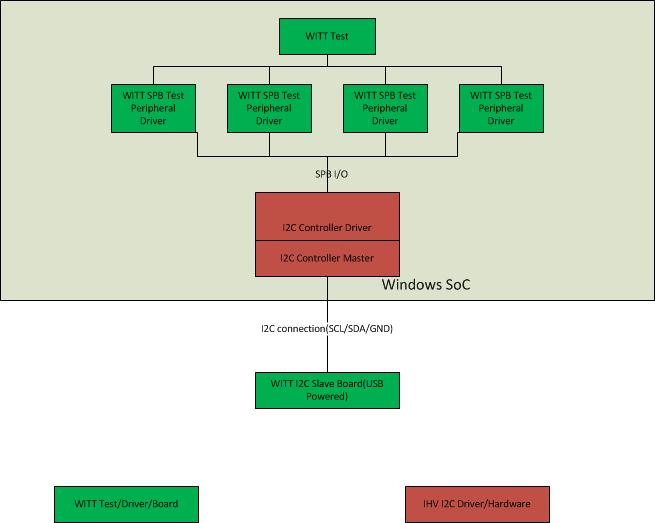
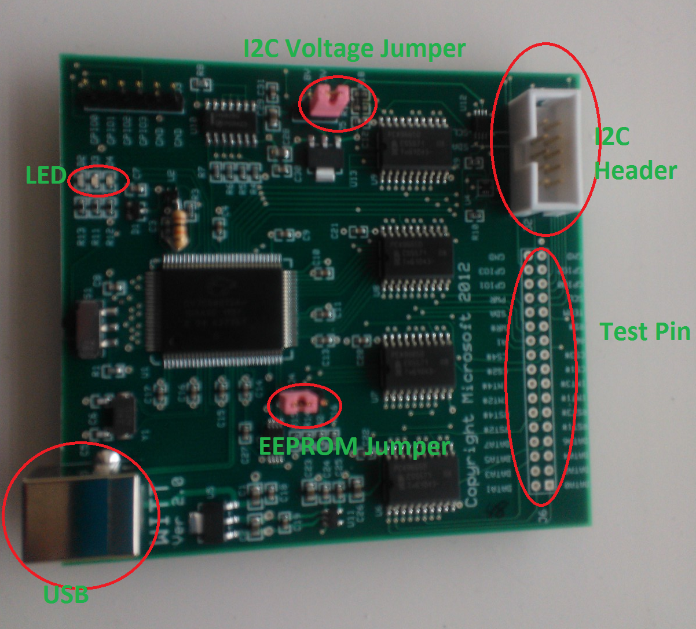
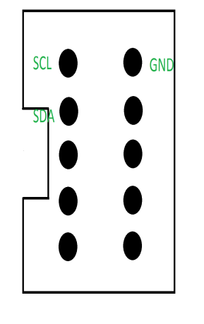

# WITT I2C Testing Prerequisites


The Windows Inter-Integrated Circuit (I<sup>2</sup>C) Testing Tool (WITT) controller tests verify Windows Hardware Lab Kit (Windows HLK) Windows Simple Peripheral Bus (SPB) compliance and the reliability of the I<sup>2</sup>C controller and its associated driver. WITT I<sup>2</sup>C controller tests consist of hardware (WITT adaptor) and software (test executable, test driver and utilities). For a list of WITT I<sup>2</sup>C tests, see [Device.BusController Tests](device-buscontroller-tests.md).

In this article:

-   [WITT I&lt;superscript xmlns="http://ddue.schemas.microsoft.com/authoring/2003/5"&gt;2&lt;/superscript&gt;C controller test hardware setup](#witti2chard)

-   [WITT I&lt;superscript xmlns="http://ddue.schemas.microsoft.com/authoring/2003/5"&gt;2&lt;/superscript&gt;C controller test software setup](#witti2csoft)

-   [I&lt;superscript xmlns="http://ddue.schemas.microsoft.com/authoring/2003/5"&gt;2&lt;/superscript&gt;C controller verification tests manual instructions](#howto)

## <span id="witti2chard"></span><span id="WITTI2CHARD"></span>WITT I<sup>2</sup>C controller test hardware setup


*Figure 1. Typical WITT test setup* shows the test, test driver setup, and I<sup>2</sup>C connections that you must make to run WITT tests.



*Figure 2. WITT Board* with I<sup>2</sup>C Header shows the LEDs, I<sup>2</sup>C header, USB connector, test pin, EEPROM jumper, and voltage jumper on a typical WITT board.



You must connect Serial Clock (SCL), Serial Data (SDA), and ground (GND) pins to the host I<sup>2</sup>C controller. The General Purpose Input/Output (GPIO) connection is not needed for the WITT I<sup>2</sup>C controller tests. The SCL, SDA, and GND pins are shown in Figure 3. I2C 10-Pin Header:



**USB**

Connect a USB cable to a USB connector (type B). You can use the USB connection to update WITT firmware (this requires a Microsoft USB Test Tool (MUTT) driver and the **Muttutil.exe** utility, which you can get from the [MUTT Software Package](http://go.microsoft.com/fwlink/?LinkID=293392). Because WITT already has I<sup>2</sup>C controller test firmware, the USB connection is used for power supply purposes only. If a firmware upgrade is necessary, use following steps:

1.  Set up the WITT I<sup>2</sup>C targets as described in [WITT I&lt;superscript xmlns="http://ddue.schemas.microsoft.com/authoring/2003/5"&gt;2&lt;/superscript&gt;C controller test software setup](#witti2csoft).

2.  From a command prompt window that has administrative privileges, run the following command:

    ``` syntax
    WITTUpgrade.exe I2C9665.iic /f
    ```

    Where **I2C9665.iic** is the firmware file and **/f** forces the upgrade to occur. (The firmware .iic file is released in the Windows HLK together with other test binaries.)

**Test pin**

The SCL/SDA/GND connectors on the test pin header can be soldered and used to connect an I<sup>2</sup>C to the host controller. The voltage of the I2C lines must match those of the host controller; these are typically 1.8v or 3.3v, and can be set by switching the voltage jumper on the WITT board (see *Figure 2. WITT Board*).

**EEPROM jumper**

The EEPROM jumper controls whether to boot from EEPROM. You should set the jumper at the position that is shown in *Figure 2. WITT Board*. (You only need to switch to the other position to recover the WITT firmware through the USB method.)

**LED**

You can interpret the LEDs as follows:

-   RED LED: POWER ON.

-   YELLOW LED: Constantly lit if there is no I<sup>2</sup>C BUS traffic (SCL and SDA are high).

-   BLUE LED: Flashing when I<sup>2</sup>C data traffic is ongoing between the host and WITT board.

**I2C voltage jumper**

This jumper can be used for level-shifting an I<sup>2</sup>C signal to WITT. Set jumper position 1-2 for 3.3v or jumper position 2-3 for 1.8v. Connect the power source to pin2 for additional voltage levels other than 1.8v and 3.3v.

## <span id="witti2csoft"></span><span id="WITTI2CSOFT"></span>WITT I<sup>2</sup>C controller test software setup


WITT test binaries are shipped together with the Windows HLK and are located on a Windows HLK controller or server in the **\\\\{$***HCKServer***}\\Tests\\{$***PROCESSOR\_ARCHITECTURE***}\\spb** folder, where *HCKServer* is the name of the Windows HLK server and *$PROCESSOR\_ARCHITECTURE* is the device platform (AMD64, x86, or ARM). The WITT I<sup>2</sup>C tests require the following binaries:

-   Test peripheral driver: **WITTTest.inf**, **WITTTest.sys**, and **WITTTest.cat**.

-   WITTTest.exe

You must use a kernel debugger during the tests. You can download and install a kernel debugger from [Download and Install Debugging Tools for Windows](http://go.microsoft.com/fwlink/?LinkID=254846).

### <span id="Typical_setup_step__single_controller_instance_"></span><span id="typical_setup_step__single_controller_instance_"></span><span id="TYPICAL_SETUP_STEP__SINGLE_CONTROLLER_INSTANCE_"></span>Typical setup step (single controller instance)

To setup a typical test configuration that uses a single controller, perform the following steps.

**To set up a typical test configuration**

1.  Open a command prompt that has administrative privileges.

2.  Run the following command to install the test peripheral driver:

    ``` syntax
    pnputil -a witttest.inf
    ```

    The *-a* flag adds the driver package to the Windows driver store.

3.  Update the Advanced Configuration and Power Interface (ACPI) table to enumerate the test device nodes. These are usually defined in the SSDT (secondary system descriptor table) or the DSDT (differentiated system description table).

    -   In the command prompt window, run the following command to generate the SSDT:

        ``` syntax
        asl.exe /tab:ssdt
        ```

    -   Edit the generated **SSDT.asl** table as follows:

        ``` syntax
        Device(TP1) {
            Name(_ADR,0)
            Name (_HID, "STK0001") 
            Name (_CID, "WITTTest") 
            Method(_CRS, 0x0, NotSerialized)
            {
              Name (RBUF, ResourceTemplate ()
              {
                I2CSerialBus ( 0x7F, ControllerInitiated, 100000,AddressingMode7Bit, "\\_SB_.I2C3",,, , )
              })
              Return(RBUF)
            }
        }
        Device(TP2) {
            Name(_ADR,0)
            Name (_HID, "STK0002") 
            Name (_CID, "WITTTest") 
            Method(_CRS, 0x0, NotSerialized)
            {
              Name (RBUF, ResourceTemplate ()
              {
                I2CSerialBus ( 0x11, ControllerInitiated, 100000,AddressingMode7Bit, "\\_SB_.I2C3",,, , )
              })
              Return(RBUF)
            }
        }
        Device(TP3) {
            Name(_ADR,0)
            Name (_HID, "STK0003") 
            Name (_CID, "WITTTest") 
            Method(_CRS, 0x0, NotSerialized)
            {
              Name (RBUF, ResourceTemplate ()
              {
                I2CSerialBus ( 0x12, ControllerInitiated, 400000,AddressingMode7Bit, "\\_SB_.I2C3",,, , )
              })
              Return(RBUF)
            }
        }
        Device(TP4) {
            Name(_ADR,0)
            Name (_HID, "STK0004") 
            Name (_CID, "WITTTest") 
            Method(_CRS, 0x0, NotSerialized)
            {
              Name (RBUF, ResourceTemplate ()
              {
                I2CSerialBus ( 0x13, ControllerInitiated, 1000000,AddressingMode7Bit, "\\_SB_.I2C3",,, , )
              })
              Return(RBUF)
            }
        }
        ```

        In this test, TP1 is used as test interface (0x7F), TP2 (0x11) is configured as standard I<sup>2</sup>C target, TP3 (0x12) is configured as fast I<sup>2</sup>C target and TP4 (0x13) is configured as fast plus I<sup>2</sup>C target.

        >[!NOTE]
        >  
        Change the I<sup>2</sup>C controller address that is listed in the table to that of the actual I<sup>2</sup>C controller.

         

4.  In the command prompt window, run the following command to generate an **Ssdt.aml** file from the modified **Ssdt.asl** file:

    ``` syntax
    asl.exe ssdt.asl
    ```

5.  In the command prompt window, run the following command to update the revised ACPI table:

    ``` syntax
    asl.exe /loadtable ssdt.aml
    ```

6.  Enable the driver verifier on the I<sup>2</sup>C Controller and in **Spbcx.sys** by using the default settings.

7.  Restart the system: four device instances should display under the **WITT Test Class** node in Device Manager in the Windows HLK.

8.  You can verify that the WITT test environment is set up correctly by running **Spbcmd.exe** from the command line. Sample command output of the **Spbcmd** tool follows, where 7F is the signature for the test interface and 01, 02 and 03 are signatures for three testing targets.

    ``` syntax
    > list
    list
    Available connection ID:
    Target:53, Instance:0x0
    Target:54, Instance:0x0
    Target:55, Instance:0x0
    Target:56, Instance:0x0
    > i2c 0x0 0x21    //this step is not necessary if you are not testing multiple instances
    i2c 0x0 0x21
    Instance requested:0x0
    I2C address requested:0x21
    Found WITT test interface at \\.\RESOURCE_HUB\0000000000000035
    WITT Testing I2C address successfully changed to 0x21 for instance 0x0
    > open 53
    open 53
    Address 53 opened
    > read 53 1
    read 53 1
    1 bytes read
      7f
    > open 54
    open 54
    Address 54 opened
    > read 54 1
    read 54 1
    1 bytes read
      01
    > write 54 {01 02 03}
    write 54 {01 02 03}
    3 bytes written
    > writeread 54 {01 02 03} 2
    writeread 54 {01 02 03} 2
    5 bytes transferred
      01 01 52 00 c0
    ```

    Use the **Open** and **Close** commands to open and close targets. **Read**, **Write**, and **WriteRead** are manual I/O commands.

    You can also use the **List** command to list all available I<sup>2</sup>C testing targets I<sup>2</sup>C: I<sup>2</sup>C 0x0 0x21. Switch the WITT testing address to start with 0x21(0x21,0x22,0x23); for example, 0 if you configured non-default I<sup>2</sup>C address in the ASL.

## <span id="howto"></span><span id="HOWTO"></span> I<sup>2</sup>C controller verification tests manual instructions


You can run the I2C controller verification test manually in addition to running it in Windows HLK Studio. This section describes how to manually run the WITT I<sup>2</sup>C controller tests. For specific information about each test, see the individual test topics.

You must run each test from a command prompt window that has administrative privileges.

Copy **wttlog.dll** from **\\\\${***HCKServer***}\\TaefBinaries** to the same directory where **Witttest.exe** resides, where *HCKServer* is the name of the Windows HLK server.

To list all available tests and command line parameters, type **wittest.exe /?** at a command prompt. For example:

``` syntax
Witttest.exe /?
Supported command line arguments are:
/rs:<Seed>
/sm internal use of acpsim load
/fw:firmwareware iic
/i2c:address
/ins:witt instance number
/dip:device instance path
/duration:stress duration in minutes
/test:<test_id>

Example:
WITTTest.exe /test:BasicIORead


Currently the following test id's are supported:
/test:BasicIORead
/test:BasicIOWrite
/test:BasicIOSeq
/test:BasicIOKernel
/test:ClkStretch
/test:DeviceNack
/test:LockUnlock
/test:CancelRead
/test:CancelWrite
/test:CancelSeq
/test:PerfRead
/test:PerfWrite
/test:PerfSeq
/test:MultipleTargets
/test:BusRecovery
/test:Power
/test:Stress
/test:RunAll
```

To run an individual test by using the default values, type **Witttest.exe /test:***&lt;Testname&gt;*, where *&lt;Testname&gt;* is the name of the test; for example, **Witttest.exe /test:BasicIORead**. To run this test with a different instance than the default instance of 0, type **Witttest.exe /test:BasicIORead /ins:0x1**. To run this test with a different testing I<sup>2</sup>C testing address instead of the default testing I<sup>2</sup>C address 0x11,0x12,0x13, type **Witttest.exe /test:BasicIORead /i2c:0x21**.

To run all tests, type **Witttest.exe /test:RunAll**. This command cycles through all tests and a test result is printed at the end of the test sequence; for example:

``` syntax
*****Test run results*****

# Test cases passed:

BasicIORead
BasicIOWrite
BasicIOSeq
BasicIOKernel
ClkStretch
LockUnlock
PerfRead
PerfWrite
PerfSeq
MultipleTargets
Stress

# Test Cases passed with warning:

CancelRead
CancelWrite
CancelSeq

# Test Cases Failed:

DeviceNack

# Total:

Pass:11 Fail:1 Warn:3
```

## <span id="related_topics"></span>Related topics


[WITT (Windows I2C Test Tool)](http://www.jjgtechnologies.com/witt.md)

[Troubleshooting Bus Controller Testing](troubleshooting-bus-controller-testing.md)

 

 


