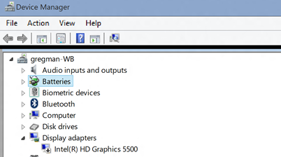

# Exercise 2 - Identify Problems with Missing Drivers

A tight integration between drivers, devices, Windows, and the firmware is required to ensure proper power management and a high rate of **DRIPS** residency.

If a device is missing a driver or doesn’t have the right driver, it can impact the associated device power management and resulting D-state.

1.  Download the pre-generated **sleepstudy-report\_2.html** report [here](http://download.microsoft.com/download/3/2/E/32E8B553-47F6-4E2A-9109-C6D678FE0EE8/sleepstudy-report_2.html).

    here.

2.  Open **sleepstudy-report\_2.html** with your favorite browser.

3.  Click on **Session 11**. The system consumes 4.585 Watts of energy during 11 minutes and the **DRIPS %** is 0.

    

4.  Look at the **Top Offenders** table. An **Unregistered Device** is listed as active 100% of the time during the session.

    

The unregistered device is the graphics adapter (GFX) as specified by the device name **\_SB.PCI0.GFX0**.

When an **Unregistered Device** is present in the top offenders list, it means that the ACPI firmware has defined it, but Windows doesn’t have it on its list of power managed devices.

This could mean one of two things:

-   One device is missing a driver.

-   An ACPI firmware constraint was defined for a device not present in the system.

In this example, the system didn’t have a proper driver installed for the **Display Adapter**, as shown below in the **Device Manager**.

 

 

