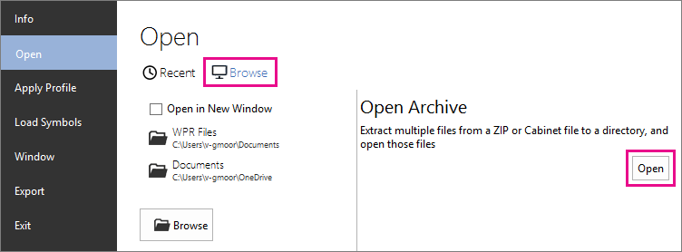
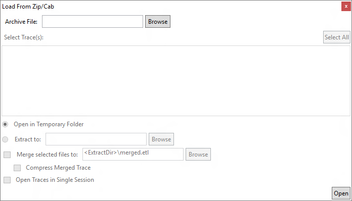

# Open an archive in WPA

WPA can open ETL files that are contained in zipped files and cabinet files, two common archive formats. A dialog box in WPA, **Load From Zip/Cab**, enables browsing files in an archive and configuring options for extraction of ETL files from the archive.

## Opening an archive

You can open **Load From Zip/Cab** by using **File&nbsp;>&nbsp;Open** to browse for a file, as for any other file that WPA can open. When you choose a zip or cab file, WPA automatically opens **Load From Zip/Cab**. 

If you are using the rich menu, **File&nbsp;>&nbsp;Open** allows you to go directly to **Load From Zip/Cab** by clicking **Open** under **Open Archive** when **Browse** is selected.

## Elements and options in **Load From Zip/Cab**

The following figure shows the **Load From Zip/Cab** dialog.

The elements and options of **Load From Zip/Cab** are described in the following table.

| Dialog element | Description |
|---|---|
| **Archive&nbsp;File** | The path and file name of the archive file. |
| **Select&nbsp;Traces** | A list of files in the selected archive file, including nested directories. |
| **Extract&nbsp;to** | The path to where you want to extract the ETL files. Specifying a location is optional. If you do not specify a path, the ETL files are extracted to a temporary folder and deleted after you close WPA. |
| **Merge&nbsp;selected&nbsp;files&nbsp;to** | Specify a path and file name to have WPA merge the extracted ETL files into a single ETL file. This is equivalent to **xperf**&nbsp;**-merge**. |
| **Compress&nbsp;Merged&nbsp;Trace** | Select this option to have WPA compress the merged file. This is equivalent to the **-compress** option used with **xperf**&nbsp;**-merge**. |
| **Open&nbsp;Traces&nbsp;in&nbsp;Single&nbsp;Session** | Select this option to analyze multiple traces together without merging them into a new trace. Otherwise, this option has the same limitations as merging. |

## Merging traces in WPA

When extracting ETL files from an archive, you can choose to have WPA merge the traces into a single trace, which is equivalent to **xperf**&nbsp;**-merge**. If you do not choose to merge the traces, then all traces selected in the archive will be opened, but WPA will consider them separate traces. 

As with Xperf, there are limitations to the merging of traces. In general, they must be from the same computer and captured during the same up time, without restarting.

